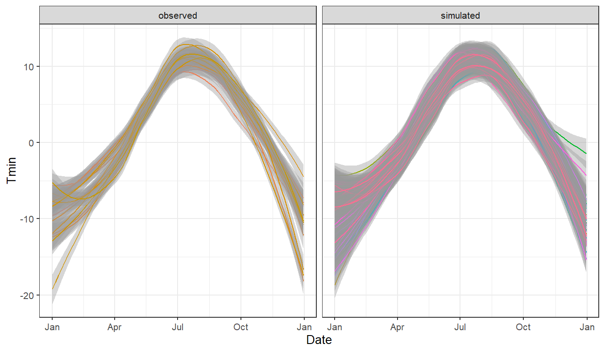
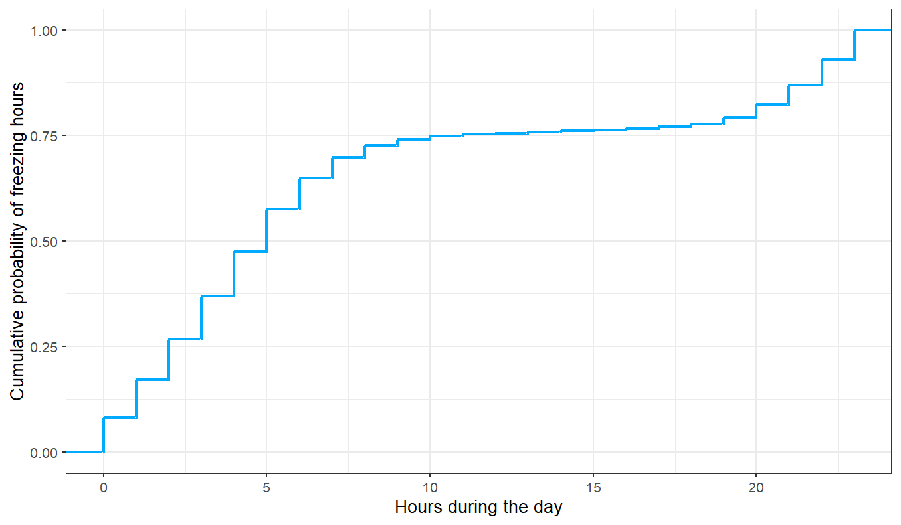
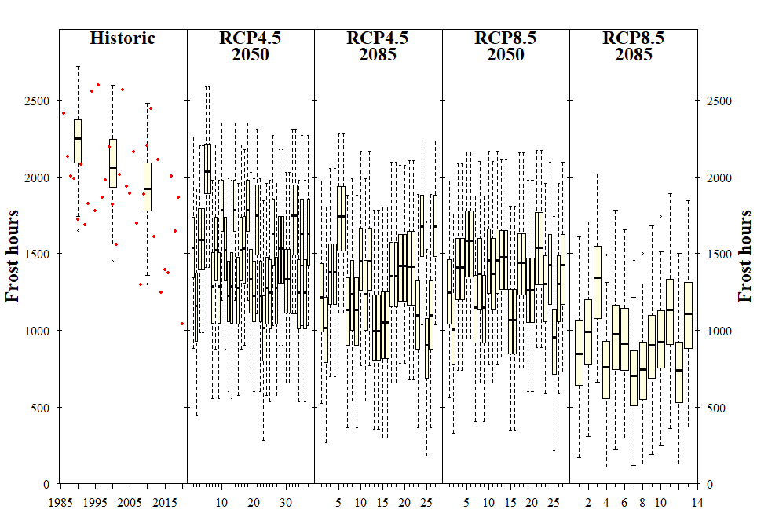
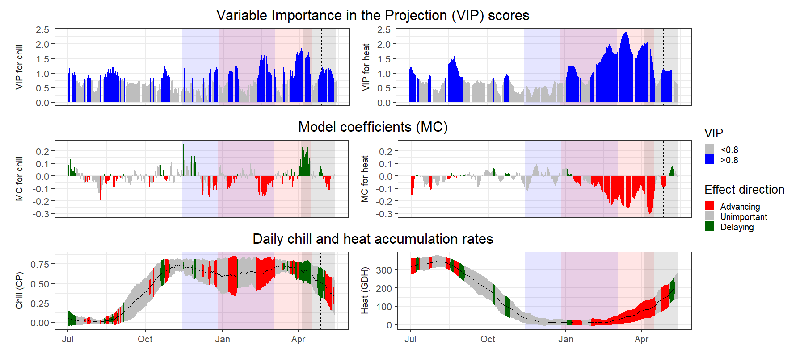
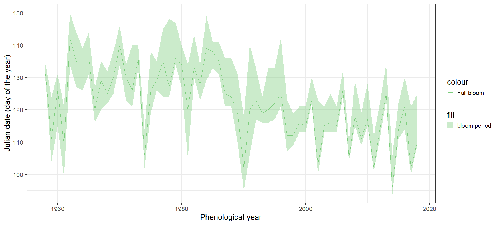

```{r setup, include=FALSE}
knitr::opts_chunk$set(echo = TRUE,fig.align="center")
```


# **03** Tree dormancy

<span style="color:gray">1. Put yourself in the place of a breeder who wants to calculate the temperature requirements of a newly released cultivar. Which method will you use to calculate the chilling and forcing periods? Please justify your answer.</span>

If phenology data of the new cultivar with the associated temperature data are available, a partial less square (PLS) regression analysis would be a good method to calculate the chilling and forcing periods.
This analysis takes into consideration the special features that present our data sets:
On the one hand the individual meteorological variables are highly autocorrelated, yet temperatures of two consecutive days are more closely correlated with each other than with temperatures of any other day.
On the other hand the number of independent data points (daily temperature record) exceed  the number of dependent variables (a flowering date per year).

<span style="color:gray">2. Which are the advantages (2) of the BBCH scale compared with earlies scales?

* The phonological stages are standardized (scale from 0 to 9). That makes it easy to recognize them under all field conditions across species. This allows to create an easily comparable metric for classification. 

* The combination of the principal and the secondary status (also scale from 0 to 9) results in the 2 digital code. In this code the first digit represents the macro stage (principal growth stage) and the second digit a specific micro stage (secondary growth stages) to precise steps within.

<span style="color:gray">3. Classify the following phenological stages of sweet cherry according to the BBCH scale:

```{r echo=FALSE,fig.cap = "Phenological stages of cherry"}
knitr::include_graphics('Figures/Lecture3.png')
```

Left image: 

* Stage 56: Flower pedicel elongating

Middle image:

* Stage 65: Flowering (To determine the correct percentage for the  a broader view is needed)

Right image:

* Stage 89: Fruit ripe for harvesting 


# **04** Climate change and impact projection

<span style="color:gray">1. List the main drivers of climate change at the decade to century scale, and briefly explain the mechanism through which the currently most important driver affects our climate.

* Sun: It warms the earth through solar radiation and her activity changes slightly over decades, but not recent climate change. 

* Aerosols: (=suspensions of liquid, solid or mixes particles with highly variable chemical compositions and size distribution) They reflect sun light so that the light doesn`t reach the earth (->cooling effect). There are natural and human causes aerosols exiting.

* Clouds: Have both warming effect (e.g. warming night) and cooling (e.g. sunny day) net effect. They are likely important but poorly understood. The effect depends probably on height, shape, and latitude.
  
* Ozone: Stratospheric ozone: It`s Shields the earth from UV-B radiation through greenhouse gas. They have a warming effect destroyed by CFCs (Chlorofluorocarbon).
* Surface albedo: Surfaces reflect/absorb radiation dependent on their material (bright surfaces e.g. ice reflect almost all radiation). -> landscape change led to change of reflection (water adsorbent almost all reflection).

* Greenhouse gases: Atmospheric gases that absorb long wavelength radiation (mostly) coming from earth (e.g. Co2, Ch4, N2O). This are by far the biggest driver of the recent climate change.

* Long-term-drivers:
  + Trends in solar activity, because of the star life cycle.
  + Ocean current/continent constellation has an influence on the global heat transfer changed (gulf stream).
  + super Volcanic ...   
There are many factors, but the most of them operate over long-time scale. The most important factor are the greenhouse gases.

<span style="color:gray">2. Explain briefly what is special about temperature dynamics of the recent decades, and why we have good reasons to be concerned.

* The last two millenniums up to a few decades ago the global climate was quite cold on average. However, looking at the last decade the average temperature keeps rising. This temperature increase brings the risk of a positive feedback, which consequences e.g., melting permafrost and reduce the albedo.
If this increase would go on it would probably lead in unstable word. We don`t know what will happen but we know that humans have never experienced warming as rapid as we have seemed in the recent decades. 

<span style="color:gray">3. What does the abbreviation ‘RCP’ stand for, how are RCPs defined, and what is their role in projecting future climates?
  * RCPs= Representative Concentration Pathways. This RCPs are the new generation of greenhouse forcing scenarios, which are the basement for global climate models (GCMs). These global models are very computationally intensive. Therefor they get down sampled for specific topics. There are two ways of down sampling: 
  + Dynamic down sampling: RCM (Regional climate model) are used with boundary conditions from GCMs
  advantage: delivers spatially coherent scenarios.
  + Statistical down sampling: Weather generators or elta changes simply add differential based on present differences.  


<span style="color:gray"> Briefly describe the 4 climate impact projection methods described in the fourth video.

* Statistical models: Establish relationship between climate parameters and impact measure.
* Species distributions modeling: It`s establish relationship between different climatic parameters and presence/absence data for species/system.
* Process-based model: There aim is to represent all major system processes with equations. They try to capture all the scientific knowledge of all processes.
* Climate analogue models: Make use of the idea that for most projected climates for a given location, we can find a place where similar climate exists today.

# **05** Winter chill projections

<span style="color:gray">1. Sketch out three data access and processing challenges that had to be overcome in order to produce chill projections with state-of-the-art methodology.

* High resolution regional temperature data: To calculate chilling hours per day high resolution temperature data is needed. But in some places (link Oman) these data were for several years missing. Fortunately, you can work around such problems if there are weather stations nearby which generously donated its data.

* Processing global data into high-resolution regional data (Tunisia): To calculate suitable data for a regional study you must use rasterized data from the GCMs and upscale them using a regional climate model. But considering an ensemble study is required, as usually the case, this scales processing and data storage requirements exponentially. This further imposes problems if no automated way of processing the data is set up.

* Processing data without programming language, usable models, or an API (up to California): Up to now a lot of data was analyzed manually with excel or filling creating data with models. This took a lot of time and was cumbersome. Different programs were used all requiring different input methods. This was later solved with a programming language.

Processing multiple scenarios increases processing and storage requirements exponentially (Kenya)


<span style="color:gray">2. Outline, in your understanding, the basic steps that are necessary to make such projections.

* First, collect proper data (long term) on projected future climates. 
* Second, choose a model and have it created scenarios.
* Third, look for a good way to present your results so that they are easier to interpret. 
* Fourth, validate the results and adjust the model if necessary or create/use a new one (start again at step two).  
 
# **06** How to write a function

In the foaling chapters, the `chillR` library is always used. 
```{r class.source = 'fold-show'}
library(chillR)

```

<span style="color:gray">1. Write a basic function that calculates warm hours (>25°C)


A basic function that calculates warm hours (>25°C) with a random data frame (`df`) could look like that:
```{r eval=FALSE }
calculate<-function(df,Warm_temp)
{
  df[,"Warm_days"]<-(df>Warm_temp)
  print(df)
  return(sum(df$Warm_days))
  
}
calculate(df,Warm_temp=25)

```

<span style="color:gray">2. Apply this function to the `Winters_hours_gaps` dataset
 

The `Winters_hours_gaps` dataset was recorded in a walnut orchard near Winters, California, in 2008. This dataset has hourly time steps, which is necessary to compute the Chilling Hours. For the calculation we just need the date, time of the measurement and the temperature data. The other parameters of the data set can be ignored.

```{r Winters_hours_gaps}

hourtemps<-Winters_hours_gaps[,c("Year","Month","Day","Hour","Temp")]

```

Now the `hourtemps` data is used as the basis for the calculation.
```{r hourtemps}
calculate_warm_hours<-function(hourWarm=hourtemps,Warm_temp=25)
{
  hourWarm[,"Warm_days"]<-(hourWarm$Temp>Warm_temp)
 
  return(sum(hourWarm$Warm_days))
  
}

calculate_warm_hours(hourtemps,Warm_temp=25)


```
Accordingly, there were 1275 hours above 25°C. 

<span style="color:gray">3. Extend this function, so that it can take start and end dates as inputs and sums up warm hours between these dates
To calculate the chilling or warm hours we used the `chillR` package. 

To calculate the temperature only within a certain period, the function must be extended.
First, the input of a date must be enabled. With the following function the date can be entered as a number like `20080304`, which is the 4^th^ March 2008. 
The function creates a list with the year, month and day.  

```{r date}

date_to_date_components<-function(date)
{
  year<-trunc(date/10000)
  month<-trunc((date-year*10000)/100)
  day<-date-(month*100)-year*10000
  return(list(Year=year,Month=month,Day=day,type="Date"))
}

```
With this we are able to extend the function. 
```{r }

calculate_warm_hours<-function(hourWarm=hourtemps,Warm_temp=25,start_date,end_date)
{
  hourWarm[,"Warm_days"]<-(hourWarm$Temp>Warm_temp)
  start<-date_to_date_components(start_date)
  end<-date_to_date_components(end_date)
  Start_row<-which(hourWarm$Year==start$Year &
                     hourWarm$Month==start$Month &
                     hourWarm$Day==start$Day &
                     hourWarm$Hour==12)
  End_row<-which(hourWarm$Year==end$Year &
                   hourWarm$Month==end$Month &
                   hourWarm$Day==end$Day &
                   hourWarm$Hour==12)
  return(sum(hourWarm$Warm_days[Start_row:End_row]))
  
}

calculate_warm_hours(hourtemps,Warm_temp=25,
                     start_date=20080401,
                     end_date=20080430)


```
Accordingly, in April 2008 `r calculate_warm_hours(hourtemps,Warm_temp=25,start_date=20080401,
end_date=20080430)` were warm hours. 

# **07** Chill models

<span style="color:gray">1. Run the `chilling()` function on the `Winters_hours_gap` dataset.

The `chillR` package has a function called `chilling()`, which implements the Chilling Hours, Utah, Dynamic Model and Growing Degree Days (GDH) in a certain time interval. We will use the `Winter_hours-gaps` dataset, which contains data from a walnut orchard near Winters, California.

```{r 3}


chilling(make_JDay(Winters_hours_gaps),Start_JDay = 10,End_JDay = 200)
```
The function gives us a summary about the chilling hours, utah, dynamic model and growing degree hours (GDH) in our selected time interval (10^th^ January to the 19^th^ July of 2008). 

<span style="color:gray">2. Create your own temperature-weighting chill model using the `step_model()` function.

The `step_model` function allows us to define our own model, based on temperature thresholds and weights. 

```{r  eval=FALSE }
myModel<-function(hourtemps,summ=TRUE)
{
  step_model(hourtemps, df = data.frame(lower =c(-1, 1.6, 2.7, 8.1, 13, 14.9, 17.9), 
                                        upper = c(1, 1.9, 9.1, 12.4, 15.9, 19, 45), 
                                        weight = c(0, 0.7, 1.1, 0.4, 0.1, -0.5,  -1)), summ = summ)
  
}

myModel(Winters_hours_gaps$Temp)
```
Due to the fact that the output of this function is a very long list, it is not shown here. 

<span style="color:gray">3. Run this model on the `Winters_hours_gaps` dataset using the `tempResponse()` function.
```{r echo=FALSE}
myModel<-function(hourtemps,summ=TRUE)
{
  step_model(hourtemps, df = data.frame(lower =c(-1, 1.4, 2.4, 9.1, 12.4, 15.9, 18), 
                                        upper = c(1.4, 2.4, 9.1, 12.4, 15.9, 18, 45), 
                                        weight = c(0, 0.5, 1, 0.5, 0, -0.5,  -1)), summ = summ)
  
}

```
```{r}
tempResponse(make_JDay(Winters_hours_gaps),
             Start_JDay = 10,End_JDay = 200,
             models = list(Chilling_Hours = Chilling_Hours, Utah_Chill_Units = Utah_Model,
                           Chill_Portions = Dynamic_Model, GDH = GDH,myModel= myModel))

```
Now we see the same summary but in an extra column the result of our model.

# **08** Making hourly temperatures
<span style="color:gray">1. Choose a location of interest, find out its latitude and produce plots of daily sunrise, sunset and daylength.

The length of the day varies depending on the latitude and the seasons.
In the following Helsinki, Finland, is selected as an exemplary region. 
```{r day}
days<-daylength(latitude = 60.17,JDay = 1:365)#to produce daily temperature curves

```
To plot the data the library `ggplot2` is used. To this we need to change the data structure for this we need the `reshape2` library. 

```{r dayplot}

library(ggplot2)
library(reshape2)
day_df<-data.frame(JDay=1:365,Sunriese=days$Sunrise,
                   Sunset=days$Sunset,
                   Daylength=days$Daylength)

day_df<-melt(day_df,id=c("JDay"))#melt data frame to facilitate the use of ggplot 


Grafic<-ggplot(day_df,aes(JDay,value))+ geom_line(lwd=1.5)+
  facet_grid(cols = vars(variable))+#create 3 plots
  ylab("Time of Day/Daylength (Hours)")+
  theme_bw((base_size=10))

Grafic
```

With the library it is also possible to display all the data in one graphic. For example: 

```{r all inone}
Grafic_allInOne<-ggplot(day_df, aes(JDay,value))+ 
  geom_line(aes(color = variable),lwd=1.5, ) + 
  ylab("Time of Day/Daylength (Hours)")+
  theme_bw((base_size=10))
  
Grafic_allInOne

```

<span style="color:gray">2. Produce an hourly dataset, based on idealized daily curves, for the KA_weather dataset (included in chillR).

The day length is an important parameter for the calculation of the daily temperature curve.  
Since longer days have the potential to be significantly hotter than cooler ones. 
There are different ways to calculate the daily temperature curve one way is the idealized daily temperature curves. We can calculate this by using the example of the dataset `KA_waether` and the `stack_hourly_temps` function of the `chillR` library. This function is prediction the ideal curve considering the latitude.

```{r Ka}
temps<-stack_hourly_temps(KA_weather, latitude = 60.17)# input dataset mast have daily minimum and maximum temperatures; output calculate hourly temperatures

```

<span style="color:gray">3. Produce empirical temperature curve parameters for the Winters_hours_gaps dataset, and use them to predict hourly values from daily temperatures (this is very similar to the example above, but please make sure you understand what’s going on).

However, there are areas where the idealized curve would not make sense, because no topological parameters are considered in the calculation. For example, a field on a north slope is significantly colder than a field on a south slope. Accordingly, an idealized curve that only refers to the latitude would not yield meaningful values.  
Therefore, there exist for example the empirical daily temperature curve. 
We used the `Empirical_daily_temperature_curve` function to predict the daily temperatures of the `Winters_hours_gaps` data. 


```{r empi}

empi_curve<-Empirical_daily_temperature_curve(Winters_hours_gaps)# determine the typical pattern of hourly temperatures at this location

ggplot(data=empi_curve[1:96,], aes(Hour,Prediction_coefficient))+geom_line(lwd=1.3, col="red")+facet_grid(rows=vars(Month))+xlab("Hour of the day")+ylab("Prediction coefficient") + theme_bw(base_size=10)
```

# **09** Getting temperature data
<span style="color:gray">1. Choose a location of interest and find the 25 closest weather stations using the handle_gsod function.

All countries of the world have weather stations that precisely record the weather. Unfortunately, this information are not freely available instead they are sold by the national weather. However there are free available temperature databases e.g. the [Global Summary of the Day (GSOD) database](https://www.ncei.noaa.gov/access/search/data-search/global-summary-of-the-day).
The `chillR` has a function called `handle_gsod()`, which makes the download of data from this website much easier. To get a first overview from the stations we can use `action="list_stations"` option. 

```{r eval=FALSE, results='asis'}

station_list<-handle_gsod(action="list_stations", #list contains the 25 closest stations to the location we entered
                          location=c(24.94,60.17), #coordinates Helsinki
                          time_interval=c(1990,2020)) 


```
The result is a list with the 25 closest stations to the location we entered.

```{r echo=FALSE, results='asis'}
library(knitr)
station_list<- read.csv("data/station_list.csv")

kable(station_list, capition="25 closest weather stations to Helsinki")
```

<span style="color:gray">2. Download weather data for the most promising station on the list.

To download the date we are using the `action="download_weather"` option of the `handle_gsod()` function. The data of the station from `HELSINKI VANTAA ` contains the period of interest for us from 1990-2020, so we download these data. 

```{r laden, eval=FALSE}
weather<-handle_gsod(action="download_weather", #download date from GSDO website 
                     location=station_list$chillR_code[11], #data from the PORVOO KALLBADAGRUND station
                     time_interval=c(1990,2020))
```

<span style="color:gray">3. Convert the weather data into chillR format.

To use this date easily in `chillR` we have to convert them. 
```{r ladeneu, eval=FALSE}
cleaned_weather<-handle_gsod(weather)
```

So we can save the data:
```{r speichern, eval=FALSE }
write.csv(station_list,"data/station_list.csv",row.names=FALSE)
write.csv(weather,"data/Helsinki_weather.csv",row.names=FALSE)
write.csv(cleaned_weather$weather,"data/Helsinki_weatherAB90.csv",row.names=FALSE)
```

# **10** Filling gaps in temperature records

<span style="color:gray">1. Use chillR functions to find out how many gaps you have in this dataset (even if you have none, please still follow all further steps).

In this lesson was the goal to deal with the gaps that our data can have. First, we will check how much data is missing.

```{r look }
Helsinki <- read.csv("data/Helsinki_weatherAB90.csv")#read in data 

```
With the `fix_weather` function in `chillR` we can get detailed information if and where data in out set are missing. The function produces a list with two outputs:
* `weather`: a `data.frame` with the interpolated weather data, now including columns `no_Tmin` and `no_Tmax`, which appear as `TRUE`, when the respective values were originally missing (`FALSE` otherwise)
* `QC`: a quality control object that summarizes how many values were interpolated for each season.

```{r }
fixed_data<-fix_weather(Helsinki)
DT::datatable(fixed_data$QC, options = list(pageLength = 10), caption="Quality control summary produced by *fix_weather()*, with all days interpolated")
```

<span style="color:gray">2. Create a list of the 25 closest weather stations using the handle_gsod function.

As we can see there are just one day in 1999, 2003 and 2020 missing. To fill this gaps, we need data from other weather stations in the neighborhood. To find them, we can again use the `handle_gsod()` function:

```{r stations, eval=FALSE}
station_list<-handle_gsod(action="list_stations",location=c(25.6, 60.17),
                          time_interval=c(1990,2020))#coordinates of weather station
```


```{r echo=FALSE, results='asis'}

DT::datatable(station_list, options = list(pageLength = 10), caption="List of GSOD weather stations close to the weather station of Kallbadagrund")
```
<span style="color:gray">3. Identify suitable weather stations for patching gaps. And download weather data for promising stations, convert them to `chillR` format and compile them in a list.

The station PORVOO KALLBADAGRUND looks most useful for us to fill our gaps. 
```{r lad, eval=FALSE}
station_listCillRcode<-c("029870_99999")#PORVOO KALLBADAGRUND

weather<- handle_gsod(handle_gsod(action="download_weather",
                                  location=station_listCillRcode[1],
                                  time_interval=c(1990,2020)))$weather


```

<span style="color:gray">5. Use the `patch_daily_temperatures` function to fill gaps.

We can now use the `patch_daily_temperatures()` function to use this data to potentially filling our gaps.
This function analysis how similar the temperature are recorded (separately for `Tmin` and `Tmax`) were between each auxiliary station and our station of interest in Helsinki, based on days for which both stations had data. Besides the number of days, for which information was taken from each auxiliary station (`filled`) and the number of gaps that remained afterwards (`gaps_remain`), we see two quality statistics:

* The mean bias (`mean_bias`), i.e. the mean temperature difference.
* The standard deviation of the daily differences (`stdev_bias`).

To limit the metrics we will set the `mean_bias` at 1 °C and the `stdev_bias` at 2°C and with the `patch_weather()` function we will try to fill the gaps.


```{r  eval=FALSE}
patched<-patch_daily_temperatures(weather = Helsinki,
                                    patch_weather = weather,
                                    max_mean_bias = 1,
                                    max_stdev_bias = 2
)

```

<span style="color:gray">6. Investigate the results - have all gaps been filled?.

We can use the `fix_weather()` function to fill the gaps and with the quality control we can take a look at where the remaining gaps are:
```{r eval=FALSE }

Helsinki_weather<-fix_weather(patched)
fixed_data<-fix_weather(Helsinki_weather)
fixed_data$QC

```

```{r echo=FALSE}

post_patch_stats<- read.csv("data/Helsinki_weatherLecture10Qc.csv")#read in data 
DT::datatable(post_patch_stats, options = list(pageLength = 10),caption="Data completeness table for the weather record from Bonn, after applying the patch procedure")


```
We can see that there is no day missing. 
Now we can save our dataset:
```{r eval=FALSE}

write.csv(Helsinki_weather$weather,"data/Helsinki_weatherLecture10.csv",row.names=FALSE)

```


# **11** Generating temperature scenarios
<span style="color:gray">1. For the location you chose for your earlier analyses, use chillR’s weather generator to produce 100 years of synthetic temperature data.

'Weather' is defined as the local climate, which is the long-term average of the annually observed weather. The 'climate' is the collection of all possible weather situations for a given location. 
`chillR` has a fuction called `temperature_generation`, which we can produce synthetic temperature data. For example, based on our data, we downloaded in the last lecture, for 100 years:


```{r eval=FALSE}

Helsinki_weather<-read.csv("data/Helsinki_weatherLecture10.csv")#loading data from the last lecture
Temp<-temperature_generation(Helsinki_weather,
                             years=c(1990,2005), #vector to specifying the years within the observed record that we want                                             to use for climate characterization
                             sim_years = c(2001,2100))# years we want to simulate

Temperatures<-cbind(Helsinki_weather[
  which(Helsinki_weather$Year %in% 1990:2005),] ,Data_source="observed")

Temperatures<-rbind(Temperatures[,c("Year","Month","Day","Tmin","Tmax","Data_source")],
                    cbind(Temp[[1]][,c("Year","Month","Day","Tmin","Tmax")],
                          Data_source="simulated"))

Temperatures[,"Date"]<-as.Date(ISOdate(2000,
                                       Temperatures$Month,
                                       Temperatures$Day))


```

We can illustrate the results with the `ggplot` library.

```{r eval=FALSE}

ggplot(data=Temperatures, aes(Date,Tmin)) +
  geom_smooth(aes(colour = factor(Year))) +
  facet_wrap(vars(Data_source)) +
  theme_bw(base_size = 20) +
  theme(legend.position = "none") +
  scale_x_date(date_labels = "%b")


ggplot(data=Temperatures, aes(Date,Tmax)) +
  geom_smooth(aes(colour = factor(Year))) +
  facet_wrap(vars(Data_source)) +
  theme_bw(base_size = 20) +
  theme(legend.position = "none") +
  scale_x_date(date_labels = "%b")


```
```{r echo=FALSE}



```

<span style="color:gray">2. Calculate winter chill (in Chill Portions) for your synthetic weather, and illustrate your results as histograms and cumulative distributions.


```{r eval=FALSE}


chill_observed <- chilling(
  stack_hourly_temps(
    Temperatures[which(Temperatures$Data_source=="observed"),],
    latitude =  60.17),
  Start_JDay = 305,
  End_JDay = 59)

chill_observed

chill_simulated<-chilling(
  stack_hourly_temps(
    Temperatures[which(Temperatures$Data_source=="simulated"),],
    latitude =  60.17),
  Start_JDay = 305,
  End_JDay = 59)

chill_simulated
chill_comparison<-cbind(chill_observed ,Data_source="observed")
chill_comparison<-rbind(chill_comparison,
                        cbind(chill_simulated ,Data_source="simulated"))
# we have to remove some incomplete years (the last of the historic and
# simulated records, where the seasons aren't complete)

chill_comparison_full_seasons<-chill_comparison[
  which(chill_comparison$Perc_complete==100),]

chill_simulations<-chill_comparison_full_seasons[
  which(chill_comparison_full_seasons$Data_source=="simulated"),]
```

We can plot the results in a histogram:
  
```{r eval=FALSE}


ggplot(chill_simulations, aes(x=Chill_portions)) +
  stat_ecdf(geom = "step",lwd=1.5,col="blue") +
  ylab("Cumulative probability") +
  xlab("Chill accumulation (in Chill Portions)") +
  theme_bw(base_size = 20)


```
```{r echo=FALSE}


```

we can see the distribution of chill accumulation in the histogram and compare between simulated and observed values. The highest frequency is around 50 chill portions. We can also illustrate the cumulative distribution of the results. 

```{r eval=FALSE}

chill_simulations<-chill_comparison_full_seasons[
  which(chill_comparison_full_seasons$Data_source=="simulated"),]

ggplot(chill_simulations, aes(x=Chill_portions)) +
  stat_ecdf(geom = "step",lwd=1.5,col="blue") +
  ylab("Cumulative probability") +
  xlab("Chill accumulation (in Chill Portions)") +
  theme_bw(base_size = 20)
```
```{r echo=FALSE}


```

We can follow the course of the chill accumulation and see that it has a slight S-shape through the ends and the rest appears to be relatively linear. 

<span style="color:gray">3. Produce similar plots for the number of freezing hours (<0°C) in April (or October, if your site is in the Southern Hemisphere) for your location of interest.

We calculate the freezing hours based on our temperature data calculated in task 1.

```{r eval=FALSE}
Temperatures<-read.csv("data/Temperatures.csv")#load data
April<-dplyr::filter(Temperatures,Month==4)#filter data from April
April_hourly<-stack_hourly_temps(April, latitude=60.17)#make hourly data
April_freezing<-dplyr::filter(April_hourly$hourtemps,Temp<0)#filter freezing hours

#plot histogram: 
ggplot(April_freezing, aes(x=Hour)) + 
  geom_histogram(fill= "#00abff") +
  labs(fill = "Data source") +
  xlab("Freezing hours spread over the day in April") +
  ylab("Frequency")


```

```{r echo=FALSE}


```

We can also create the cumulative plot:
  
```{r eval=FALSE }

ggplot(April_freezing, aes(x=Hour)) +
  stat_ecdf(geom = "step",lwd=1.5,col="#00abff") +
  ylab("Cumulative probability") +
  xlab("Freezig accumulation (in freezing hours)") +
  theme_bw(base_size = 20)

```


```{r echo=FALSE}


```
As a short explanation e.g. the hour 0 of the day corresponds to 0am  and the hour 15 corresponds to 3pm. 

# **12** Saving and loading data (and hiding this in markdown)

In this carp chapter we have learned several functions to save date/scenarios like the `save_temperature_scenarios()` function.

# **13** Historic temperature scenarios
<span style="color:gray">1. For the location you chose for previous exercises, produce historic temperature scenarios representing several years of the historic record (your choice).

We can for example us it to generate a scenario that represent particular years from the historic record. This has the advantage that we get to know what temperature conditions should have been considered normal at the time, rather than what happened. With this scenario we can try to evaluate the gradual shift in climate.
But first we must generate them: 

```{r eval=FALSE}

scenario_1990<-temperature_scenario_from_records(weather=Helsinki_weather,year=1990)

scenario_1990

temps_1990<-temperature_generation(weather=Helsinki_weather, years=c(1990,2020),
                                   sim_years=c(2001,2100),
                                   temperature_scenario = scenario_1990)


# The central year of the dataset we downloaded is 2005, so we make a 2005 scenario
scenario_2005<-temperature_scenario_from_records(weather=Helsinki_weather,year=2005)

# Now we can use these two scenarios to convert the 1990 scenario into a scenario
# of relative change compared to the 2000 baseline

relative_scenario<-temperature_scenario_baseline_adjustment(
  baseline=scenario_2005,
  temperature_scenario = scenario_1990)


# Now we make a 1990 scenario with this new relative scenario
temps_1990<-temperature_generation(weather=Helsinki_weather, years=c(1990,2020),
                                   sim_years=c(2001,2100),
                                   temperature_scenario = relative_scenario)

temps_1990_fail<-temperature_generation(weather=Helsinki_weather, years=c(1990,2020),
                                        sim_years=c(2001,2100),
                                        temperature_scenario = relative_scenario)

all_past_scenarios<-temperature_scenario_from_records(
  weather=Helsinki_weather,
  year=c(1990,2000,2010))

adjusted_scenarios<-temperature_scenario_baseline_adjustment(
  baseline=scenario_2005,
  temperature_scenario = all_past_scenarios)

all_past_scenario_temps<-temperature_generation(
  weather=Helsinki_weather,
  years=c(1990,2020),
  sim_years=c(2001,2100),
  temperature_scenario = adjusted_scenarios)

```
In this example we used the data from 1990 to 2020 and created a scenario for 1990, 2000 and 2020. 

<span style="color:gray">2. Produce chill distributions for these scenarios and plot them.


```{r eval=FALSE}

chill_hist_scenario_list<-tempResponse_daily_list(all_past_scenario_temps,
                                                  latitude=60.17,
                                                  Start_JDay = 305,
                                                  End_JDay = 59)

chill_hist_scenario_list

#prepare for plotting all this

scenarios<-names(chill_hist_scenario_list)[1:4]

all_scenarios<-chill_hist_scenario_list[[scenarios[1]]]
all_scenarios[,"scenario"]<-as.numeric(scenarios[1])


for (sc in scenarios[2:4])
  all_scenarios<-rbind(all_scenarios,
                       cbind(chill_hist_scenario_list[[sc]],
                             scenario=as.numeric(sc)))

all_scenarios<-all_scenarios[which(all_scenarios$Perc_complete==100),]

# Let's compute the actual 'observed' chill for comparison
actual_chill<-tempResponse_daily_list(Helsinki_weather,latitude= 60.17,
                                      Start_JDay = 305,
                                      End_JDay = 59)[[1]]
actual_chill<-actual_chill[which(actual_chill$Perc_complete==100),]

# now we're ready for plotting
g <- ggplot(data=all_scenarios,aes(scenario,Chill_Portions,
                                   fill=factor(scenario)))+geom_violin()+ylab("Chill accumulation (Chill Portions)") +
  xlab("Scenario year") +
  theme_bw(base_size=15)+ ylim(c(0,90)) + geom_point(data=actual_chill,
                    aes(End_year,Chill_Portions,fill="blue"),
                    col="blue",show.legend = FALSE) + scale_fill_discrete(name="Scenario",
                             breaks = unique(all_scenarios$scenario)) 


g
```


```{r echo=FALSE,out.width = '70%'}


```

# **14** Future temperature scenarios
<span style="color:gray">1. Analyze the historic and future impact of climate change on three agroclimatic metrics of your choice, for the location you’ve chosen for your earlier analyses.


`chillR` has a function that can access a useful database of climate information, the `ClimateWizard` database, maintained by the Center for Tropical Agriculture (CIAT). The `getClimateWizardData` function we have access to point-specific data for climate scenarios produced by multiple climate models. The function only returns information for the coordinates and climate metrics we specified. 
It is important to know that for the function needs an interval of at least 20 years within the [1950; 2005] interval. A brief analysis showed that our original weather stations have little data in the year 1986. Therefore, a new weather station must be found first to extend our weather data back to 1985: 
```{r eval=FALSE}

Helsinki_temps<-read_tab("data/Helsinki_weatherfixed.csv")

#check station list, which sation has data on the desired year:
station_listCillRcode <- read.csv("data/station_list.csv")
``` 
```{r echo=FALSE, results='asis'}

DT::datatable(station_list, options = list(pageLength = 10),caption="List of GSOD weather stations close to the weather station of Kallbadagrund")
```
We chose the station with the Rcode "029880_99999" to fill the gaps. 
```{r eval=FALSE}

station_listCillRcode<-c("029740_99999")

#download and save data:
weather<- handle_gsod(handle_gsod(action="download_weather",
                                  location=station_listCillRcode[1],
                                  time_interval=c(1985,2020)))$weather

write.csv(weather,"dataNew/Helsinki_weatherAB85.csv",row.names=FALSE)

# fill gaps the gaps:
station_listCillRcode<-c("029880_99999")

weather85<- handle_gsod(handle_gsod(action="download_weather",
                                    location=station_listCillRcode[1],
                                    time_interval=c(1985,2020)))$weather

write.csv(weather85,"dataNew/Helsinki_weather85.csv",row.names=FALSE)

Helsinki_weather85 <- read.csv("dataNew/Helsinki_weather85.csv")

sum(is.na(Helsinki_weather85$Day))#filled all gaps


patched86<-patch_daily_temperatures(weather = Helsinki_weatheralt90,
                                    patch_weather = Helsinki_weather86,
                                    max_mean_bias = 1,
                                    max_stdev_bias = 2
)

Helsinki_weather85all<-fix_weather(patched86)
fixed_data<-fix_weather(Helsinki_weather85all)
fixed_data$QC
write.csv(fixed_data$weather,"data/Helsinki_weather85fixed.csv",row.names=FALSE)

Helsinki_temps<- read.csv("data/Helsinki_weather85fixed.csv")

```

Now we can start to download the climate scenario data:

```{r eval=FALSE}

RCPs<-c("rcp45","rcp85")
Times<-c(2050,2085)


for(RCP in RCPs)
  for(Time in Times)
  {start_year <- Time-15
  end_year <- Time+15
  clim_scen <-getClimateWizardData(
    c(longitude = 24.963, latitude =  60.17),
    RCP,
    start_year,
    end_year,
    temperature_generation_scenarios = TRUE,
    baseline =c(1985,2005),
    metric = "monthly_min_max_temps",
    GCMs = "all")
  save_temperature_scenarios(clim_scen,
                             "dataNew/ClimateWizard",
                             paste0("Helsinki_futures_",Time,"_",RCP))}

# The ClimateWizard data is (by default) given relative to a 1990 baseline,
# so we have to make adjustment scenarios (the baseline of our observed data
# is 2002.5, not 1990)

scenario_1990<-temperature_scenario_from_records(Helsinki_temps,1995)
scenario_2002.5<-temperature_scenario_from_records(Helsinki_temps,2002.5)
adjustment_scenario<-temperature_scenario_baseline_adjustment(scenario_2002.5,
                                                              scenario_1990)

adjustment_scenario

# Now we can use this to adjust all the downloaded climate scenarios.
# We can directly add the temperature generation step 

RCPs<-c("rcp45","rcp85")
Times<-c(2050,2085)

for(RCP in RCPs)
  for(Time in Times)
  {
    clim_scen<-load_ClimateWizard_scenarios(
      "data/ClimateWizard",
      paste0("Helsinki_futures_",Time,"_",RCP))
    clim_scen_adjusted<-
        temperature_scenario_baseline_adjustment(
        baseline_temperature_scenario=adjustment_scenario,
        temperature_scenario=clim_scen)
    Temps<-temperature_generation(
      weather=Helsinki_temps, 
      years=c(1985,2020),
      sim_years=c(2001,2101),
      temperature_scenario = clim_scen_adjusted)
    save_temperature_scenarios(
      Temps,
      "data/Weather",
      paste0("Helsinki_",Time,"_",RCP))
  }

# We'll add some historic scenarios as well

all_past_scenarios<-temperature_scenario_from_records(
  weather=Helsinki_temps,
  year=c(1990,2000,2010))

adjusted_scenarios<-temperature_scenario_baseline_adjustment(
  baseline=scenario_2005,
  temperature_scenario = all_past_scenarios)


all_past_scenario_temps <- temperature_generation(
  weather = Helsinki_temps,
  years = c(1985, 2020),
  sim_years = c(2001, 2101),
  temperature_scenario = adjusted_scenarios
)

save_temperature_scenarios(all_past_scenario_temps,
                           "data/Weather",
                           "Helsinki_historic")

# Now temperature data for all scenarios are saved. Let's now make temperature
# response functions to apply to these scenarios

frost_model <- function(x)
  step_model(x,
             data.frame(
               lower = c(-273, 0),
               upper = c(0, 1000),
               weight = c(1, 0)
             ))

models <- list(Chill_CP = Dynamic_Model,
               Heat_GDH = GDH,
               Frost_H = frost_model)

# Now we first apply this to the historic scenarios and the observed temperature
# data

Temps <- load_temperature_scenarios("data/Weather", "Helsinki_historic")
chill_past_scenarios <- tempResponse_daily_list(
  Temps,
  latitude =  60.17,
  Start_JDay = 305,
  End_JDay = 59,
  models = models,
  misstolerance = 10
)
chill_observed <- tempResponse_daily_list(
  Helsinki_temps,
  latitude = 60.17,
  Start_JDay = 305,
  End_JDay = 59,
  models = models,
  misstolerance = 10
)

save_temperature_scenarios(chill_past_scenarios,
                           "data/chill",
                           "Helsinki_historic")
save_temperature_scenarios(chill_observed,
                           "data/chill",
                           "Helsinki_observed")

# Let's plot the historic and observed data. 

chill_past_scenarios<-load_temperature_scenarios(
  "data/chill",
  "Helsinki_historic")
chill_observed<-load_temperature_scenarios(
  "data/chill",
  "Helsinki_observed")

chills <- make_climate_scenario(
  chill_past_scenarios,
  caption = "Historic",
  historic_data = chill_observed,
  time_series = TRUE
)

plot_climate_scenarios(
  climate_scenario_list=chills,
  metric="Chill_CP",
  metric_label="Chill (Chill Portions)")

# Now we can use the same procedure on the future data


for(RCP in RCPs)
  for(Time in Times)
  {
    Temps<-load_temperature_scenarios(
      "data/Weather",
      paste0("Helsinki_",Time,"_",RCP))
    chill<-tempResponse_daily_list(
      Temps,
      latitude= 60.17,
      Start_JDay = 305,
      End_JDay = 59,
      models=models,
      misstolerance = 10)
    save_temperature_scenarios(
      chill,
      "data/chill",
      paste0("Helsinki_",Time,"_",RCP))
  }

# To plot the results, we should make scenarios out of them

for(RCP in RCPs)
  for(Time in Times)
  {
    chill<-load_temperature_scenarios(
      "data/chill",
      paste0("Helsinki_",Time,"_",RCP))
    if(RCP=="rcp45") RCPcaption <- "RCP4.5"
    if(RCP=="rcp85") RCPcaption <- "RCP8.5"
    if(Time=="2050") Time_caption <- "2050"
    if(Time=="2085") Time_caption <- "2085"
    chills <-make_climate_scenario(
      chill,
      caption =c(RCPcaption, Time_caption),
      add_to = chills)
  }

# And here's our plot of all of this
# First for the chill model

plot_climate_scenarios(
  climate_scenario_list=chills,
  metric="Chill_CP",
  metric_label="Chill (Chill Portions)",
  texcex=1.5)

# Now for heat

plot_climate_scenarios(
  climate_scenario_list=chills,
  metric="Heat_GDH",
  metric_label="Heat (Growing Degree Hours)",
  texcex=1.5)

# Now for frost

plot_climate_scenarios(
  climate_scenario_list=chills,
  metric="Frost_H",
  metric_label="Frost hours",
  texcex=1.5)

```


```{r echo=FALSE,out.width = '90%'}




```

# **15** Plotting future scenarios

<span style="color:gray">1. Produce similar plots for the weather station you selected for earlier exercises.

```{r eval=FALSE}
library(chillR)
library(ggplot2)
library(reshape2)
library(kableExtra)
library(ggpmisc)
library(patchwork)
#load data


chill_past_scenarios<-load_temperature_scenarios(
  "data/chill",
  "Helsinki_historic")
chill_observed<-load_temperature_scenarios(
  "data/chill",
  "Helsinki_observed")

chills <-make_climate_scenario(
  chill_past_scenarios,
  caption = "Historic",
  historic_data = chill_observed,
  time_series = TRUE)

RCPs<-c("rcp45","rcp85")
Times<-c(2050,2085)

for(RCP in RCPs)
  for(Time in Times)
  { chill<-load_temperature_scenarios(
    "data/chill",
    paste0("Helsinki_",Time,"_",RCP))
  if(RCP=="rcp45") RCPcaption <- "RCP4.5"
  if(RCP=="rcp85") RCPcaption <- "RCP8.5"
  if(Time=="2050") Time_caption <- "2050"
  if(Time=="2085") Time_caption <- "2085"
  chills <-make_climate_scenario(
    chill,
    caption =c(RCPcaption, Time_caption),
    add_to = chills)
  }

#reshape data for ggplot

for(nam in names(chills[[1]]$data))
{
  # Extract the data frame.
  ch<-chills[[1]]$data[[nam]]
  # Add columns for the new information we have to add and fill them.
  ch[,"GCM"]<-"none"
  ch[,"RCP"]<-"none"
  ch[,"Year"]<-as.numeric(nam)
  
  # Now check if this is the first time we've gone through this loop.
  # If this is the first time, the ch data.frame becomes the output
  # object (past_simulated).
  # If it is not the first time ('else'), we add the current data.frame
  # to the 'past_simulated' object
  if(nam==names(chills[[1]]$data)[1])
    past_simulated<-ch else
      past_simulated<-rbind(past_simulated,ch)
}

# add another column called 'Scenario' and label all rows as 'Historic' 
past_simulated["Scenario"] <- "Historic"

past_observed <- chills[[1]][["historic_data"]]

for(i in 2:length(chills))
  for(nam in names(chills[[i]]$data))
  {ch<-chills[[i]]$data[[nam]]
  ch[,"GCM"]<-nam
  ch[,"RCP"]<-chills[[i]]$caption[1]
  ch[,"Year"]<-chills[[i]]$caption[2]
  if(i==2&nam==names(chills[[i]]$data)[1])
    future_data<-ch else
      future_data<-rbind(future_data,ch)
  }


#function for plotting:
plot_scenarios_gg<-function(past_observed,
                            past_simulated,
                            future_data,
                            metric,
                            axis_label)
{
  rng<-range(past_observed[[metric]],
             past_simulated[[metric]],
             future_data[[metric]])  
  past_plot<-ggplot() +
    geom_boxplot(data = past_simulated,
                 aes_string("as.numeric(Year)",metric,group="Year"),
                 fill="skyblue") +
    scale_y_continuous(limits = c(0, round(round(1.1*rng[2])))) +
    labs(x = "Year", y = axis_label) +
    facet_grid(~ Scenario) +
    geom_point(data = past_observed,
               aes(End_year,Heat_GDH, colour="Data points"))+
    theme_bw(base_size = 15)  +
    theme(strip.background = element_blank(),
          legend.position=c(0.1,0.9),
          legend.title=element_blank(),
          axis.text.x = element_text(angle=45, hjust=1))
  
  future_plot_list<-list()
  
  for(y in c(2050,2085))
  {
    future_plot_list[[which(y == c(2050,2085))]] <-
      ggplot(data= future_data[which(future_data$Year==y),]) +
      geom_boxplot(aes_string("GCM", metric, fill="GCM")) +
      facet_wrap(vars(RCP)) +
      scale_x_discrete(labels = NULL, expand = expansion(add = 1)) +
      scale_y_continuous(limits = c(0, round(round(1.1*rng[2])))) +
      geom_text_npc(aes(npcx = "center", npcy = "top", label = Year),
                    size = 5) +
      theme_bw(base_size = 15) +
      theme(axis.ticks.y = element_blank(),
            axis.text = element_blank(),
            axis.title = element_blank(),
            legend.position=c(0.1,0.9),
            legend.margin = margin(0, 0, 0, 0, "cm"),
            legend.background = element_rect(),
            strip.background = element_blank(),
            strip.text = element_text(face = "bold"),
            legend.box.spacing = unit(0, "cm"),
            plot.subtitle = element_text(hjust = 0.5,
                                         vjust = -1,
                                         size = 15 * 1.05,
                                         face = "bold")) 
  }
  
  plot<- (past_plot +
            future_plot_list) +
            plot_layout(guides = "collect",
                        widths = c(1,rep(1.8,length(future_plot_list))))
  plot
  
}
plot_scenarios_gg(past_observed=past_observed,
                  past_simulated=past_simulated,
                  future_data=future_data,
                  metric="Heat_GDH",
                  axis_label="Heat (in Growing Degree Hours)")
}


#call plotting function

plot_scenarios_gg(past_observed=past_observed,
                  past_simulated=past_simulated,
                  future_data=future_data,
                  metric="Heat_GDH",
                  axis_label="Heat (in Growing Degree Hours)")

```

```{r echo=FALSE}


```

# **16** Chill model comparison


<span style="color:gray">1. Perform a similar analysis for the location you’ve chosen for your exercises.

In this lecture we want to assess past and future changes in Safe Winter Chill using multiple chill models. Safe Winter Chill is defined as the 10% quantile of the kind of chill distributions. 
This calculation offers an opportunity for reducing the complexity of our simulation results by presenting our data in different formats like a heat map. We will use the heat map to illustrate differences in the behavior of the various chill models that have been used in the literature (and sometimes in practice).

To do this we first have to install the `dormancyR` package, load `dormancyR` and `chillR` and check what models are available there. With the `devtools` package, we can install the `dormancyR`package directly from github.

```{r eval=FALSE}
library(chillR)
library(devtools)
install_github("EduardoFernandezC/dormancyR")
library(dormancyR)

# collection of all the chill models from chillR
# in separate lists
hourly_models <- list(Chilling_units = chilling_units,
                      Low_chill = low_chill_model,
                      Modified_Utah = modified_utah_model,
                      North_Carolina = north_carolina_model,
                      Positive_Utah = positive_utah_model,
                      Chilling_Hours = Chilling_Hours,
                      Utah_Chill_Units = Utah_Model,
                      Chill_Portions = Dynamic_Model)
daily_models<-list(Rate_of_Chill = rate_of_chill,
                   Chill_Days = chill_days,
                   Exponential_Chill = exponential_chill,
                   Triangula_Chill_Haninnen = triangular_chill_1,
                   Triangular_Chill_Legave = triangular_chill_2)

metrics<-c(names(daily_models),names(hourly_models))

model_labels=c("Rate of Chill",
               "Chill Days",
               "Exponential Chill",
               "Triangular Chill (Häninnen)",
               "Triangular Chill (Legave)",
               "Chilling Units",
               "Low-Chill Chill Units",
               "Modified Utah Chill Units",
               "North Carolina Chill Units",
               "Positive Utah Chill Units",
               "Chilling Hours",
               "Utah Chill Units",
               "Chill Portions")

data.frame(Metric=model_labels,'Function name'=metrics)

# apply models to the Helsinki_temps dataset and historic
# weather scenarios 

Helsinki_temps<-read_tab("data/Helsinki_weather85fixed.csv")
Temps<-load_temperature_scenarios("data/Weather","Helsinki_historic")

#apply models to the Helsinki dataset

Start_JDay<-305
End_JDay<-59

# apply daily models to past scenarios

daily_models_past_scenarios <- tempResponse_list_daily(Temps,
                                                       Start_JDay = Start_JDay,
                                                       End_JDay = End_JDay,
                                                       models = daily_models)
daily_models_past_scenarios <- lapply(daily_models_past_scenarios,
                                      function(x)
                                        x[which(x$Perc_complete > 90), ])

# apply hourly models to past scenarios

hourly_models_past_scenarios<-tempResponse_daily_list(
  Temps,
  latitude= 60.17,
  Start_JDay = Start_JDay,
  End_JDay = End_JDay,
  models=hourly_models,
  misstolerance = 10)

past_scenarios <- daily_models_past_scenarios
past_scenarios <- lapply(names(past_scenarios),
                         function(x)
                           cbind(past_scenarios[[x]],
                                 hourly_models_past_scenarios[[x]][, names(hourly_models)]))
names(past_scenarios) <- names(daily_models_past_scenarios)

# apply daily models to past observations

daily_models_observed <- tempResponse_daily(
  Helsinki_temps,
  Start_JDay = Start_JDay,
  End_JDay = End_JDay,
  models = daily_models
)
daily_models_observed <-
  daily_models_observed[which(daily_models_observed$Perc_complete > 90), ]

# apply hourly models to past observations

hourly_models_observed<-tempResponse_daily_list(
  Helsinki_temps,
  latitude= 60.17,
  Start_JDay = Start_JDay,
  End_JDay = End_JDay,
  models=hourly_models,
  misstolerance = 10)

past_observed<-cbind(
  daily_models_observed,
  hourly_models_observed[[1]][,names(hourly_models)])

# save all the results

save_temperature_scenarios(past_scenarios,
                           "data/chill",
                           "Helsinki_multichill_historic")
write.csv(past_observed,
          "data/chill/Helsinki_multichill_observed.csv",
          row.names=FALSE)

#  procedure for future scenarios

RCPs<-c("rcp45","rcp85")
Times<-c(2050,2085)

for(RCP in RCPs)
  for(Time in Times)
  {
    Temps<-load_temperature_scenarios(
      "data/Weather",
      paste0("Helsinki_",Time,"_",RCP))
    
    daily_models_future_scenarios<-tempResponse_list_daily(
      Temps,
      Start_JDay = Start_JDay,
      End_JDay = End_JDay,
      models=daily_models)
    daily_models_future_scenarios<-lapply(
      daily_models_future_scenarios,
      function(x) x[which(x$Perc_complete>90),])
    hourly_models_future_scenarios<-
      tempResponse_daily_list(
        Temps,
        latitude=60.17,
        Start_JDay = Start_JDay,
        End_JDay = End_JDay,
        models=hourly_models,
        misstolerance = 10)
    
    future_scenarios<-daily_models_future_scenarios
    future_scenarios<-lapply(
      names(future_scenarios),
      function(x)
        cbind(future_scenarios[[x]],
              hourly_models_future_scenarios[[x]][,names(hourly_models)]))
    names(future_scenarios)<-names(daily_models_future_scenarios)
    
    chill<-future_scenarios#save scenarios
    save_temperature_scenarios(
      chill,
      "data/chill",
      paste0("Helsinki_multichill_",Time,"_",RCP))
  }

# make scenarios we can plot

chill_past_scenarios<-load_temperature_scenarios(
  "data/chill",
  "Helsinki_multichill_historic")
chill_observed<-read_tab("data/chill/Helsinki_multichill_observed.csv")

chills <-make_climate_scenario(chill_past_scenarios,
                               caption = "Historic",
                               historic_data = chill_observed,
                               time_series = TRUE)

for(RCP in RCPs)
  for(Time in Times)
  {
    chill<-load_temperature_scenarios(
      "data/chill",
      paste0("Helsinki_multichill_",Time,"_",RCP))
    if(RCP=="rcp45") RCPcaption <- "RCP4.5"
    if(RCP=="rcp85") RCPcaption <- "RCP8.5"
    if(Time=="2050") Time_caption <- "2050"
    if(Time=="2085") Time_caption <- "2085"
    chills <-make_climate_scenario(chill,
                                   caption =c(RCPcaption,Time_caption),
                                   add_to = chills)
  }


```

<span style="color:gray">2. Make a heat map illustrating past and future changes in Safe Winter Chill(SWC), relative to a past scenario, for the 13 chill models used here.

````{r eval=FALSE}
# compute SWC for all scenarios and change structure for ggplot

for(i in 1:length(chills))
{
  ch <- chills[[i]]
  if (ch$caption[1] == "Historic")
  {
    GCMs <- rep("none", length(names(ch$data)))
    RCPs <- rep("none", length(names(ch$data)))
    Years <- as.numeric(ch$labels)
    Scenario <- rep("Historic", length(names(ch$data)))
  } else
  {
    GCMs <- names(ch$data)
    RCPs <- rep(ch$caption[1], length(names(ch$data)))
    Years <- rep(as.numeric(ch$caption[2]), length(names(ch$data)))
    Scenario <- rep("Future", length(names(ch$data)))
  }
  for (nam in names(ch$data))
  {
    for (met in metrics)
    {
      temp_res <- data.frame(
        Metric = met,
        GCM = GCMs[which(nam == names(ch$data))],
        RCP = RCPs[which(nam == names(ch$data))],
        Year = Years[which(nam == names(ch$data))],
        Result = quantile(ch$data[[nam]][, met], 0.1),
        Scenario = Scenario[which(nam == names(ch$data))]
      )
      if (i == 1 & nam == names(ch$data)[1] & met == metrics[1])
        results <- temp_res
      else
        results <- rbind(results, temp_res)
      
    }
  }
}

for (met in metrics)
  results[which(results$Metric == met), "SWC"] <- results[which(results$Metric == met), "Result"] /results[which(results$Metric == met &
                  results$Year == 1990), "Result"] - 1

#plot it
library(ggplot2)#plot 
library(colorRamps)#colour
library(patchwork)#combine plots

rng = range(results$SWC)

p_future <- ggplot(results[which(!results$GCM == "none"), ],
                   aes(GCM, y = factor(Metric, levels = metrics),
                       fill = SWC)) +
  geom_tile() +
  facet_grid(RCP ~ Year) +
  theme_bw(base_size = 15) +
  theme(axis.text = element_text(size=8))

p_future <-
  p_future +
  scale_fill_gradientn(colours=rev(matlab.like(15)),
                       labels = scales::percent,
                       limits=rng) +
  theme(axis.text.x = element_text(
    angle = 75,
    hjust = 1,
    vjust = 1
  )) +
  labs(fill = "Change in\nSafe Winter Chill\nsince 1985") +
  scale_y_discrete(labels = model_labels) +
  ylab("Chill metric")

p_past<-
  ggplot(results[which(results$GCM=="none"),],
         aes(Year, y=factor(Metric, levels=metrics),
             fill = SWC)) +
  geom_tile() +
  theme_bw(base_size = 15) +
  theme(axis.text = element_text(size=8))+
  scale_fill_gradientn(colours=rev(matlab.like(15)),
                       labels = scales::percent,
                       limits=rng) +
  scale_x_continuous(position = "top") +
  labs(fill = "Change in\nSafe Winter Chill\nsince 1985") +
  scale_y_discrete(labels=model_labels) +
  ylab("Chill metric")

#combine the past and future plots

chill_comp_plot <-
  (p_past +
     p_future +
     plot_layout(
       guides = "collect",
       nrow = 2,
       heights = c(1, 2)
     )) &
  theme(
    legend.position = "right",
    strip.background = element_blank(),
    strip.text = element_text(face = "bold")
  )

chill_comp_plot


```

```{r echo=FALSE,out.width = '80%'}


```

<span style="color:gray">3. Produce an animated line plot of your results (summarizing Safe Winter Chill across all the GCMs).

```{r eval=FALSE}
# pre-processing 

hist_results<-results[which(results$GCM=="none"),]
hist_results$RCP<-"RCP4.5"
hist_results_2<-hist_results
hist_results_2$RCP<-"RCP8.5"
hist_results<-rbind(hist_results,hist_results_2)

future_results<-results[which(!results$GCM=="none"),]

GCM_aggregate<-aggregate(
  future_results$SWC,
  by=list(future_results$Metric,future_results$RCP,future_results$Year),
  FUN=mean)
colnames(GCM_aggregate)<-c("Metric","RCP","Year","SWC")

RCP_Time_series<-rbind(hist_results[,c("Metric","RCP","Year","SWC")],
                       GCM_aggregate)

# creating a static plot of chill development over time according to all chill models

chill_change_plot<-
  ggplot(data=RCP_Time_series,
         aes(x=Year,y=SWC,col=factor(Metric,levels=metrics))) +
  geom_line(lwd=1.3) +
  facet_wrap(~RCP,nrow=2) +
  theme_bw(base_size=15) +
  labs(col = "Change in\nSafe Winter Chill\nsince 1985") +
  scale_color_discrete(labels=model_labels) +
  scale_y_continuous(labels = scales::percent) +
  theme(strip.background = element_blank(),
        strip.text = element_text(face = "bold")) +
  ylab("Safe Winter Chill")+ 

  
#animate plot

  library(gganimate)
chill_change_plot + transition_reveal(Year)

anim_save("data/chill_comparison_animation.gif", animation = last_animation())
```

```{r echo=FALSE}


```


# **17** simple phenology analysis

<span style="color:gray">1.Provide a brief narrative describing what p-hacking is, and why this is a problematic approach to data analysis.

The aim of a data analysis is to find a correlation between the data.  
A very simple relationship between data is e.g., a linear relationship. When testing whether data have a linear relationship to each other, the degree of probability of this relationship can be given by the p-value.
In general, is the p-value the probability of obtaining test results at least as extreme as the results actually observed, under the assumption that the null hypothesis is correct. Some people use this value to find patterns in data that can be presented as statistically significant (high p-value), thus dramatically increasing, and understating the risk of false positives. This method is called p-hacking. The process of data dredging involves testing multiple hypotheses using a single data set by exhaustively searching—perhaps for combinations of variables that might show a correlation, and perhaps for groups of cases or observations that show differences in their mean or in their breakdown by some other variable. The idea of having several hypotheses contradicts the basic principles of scientific work. These types of screening can lead to hypotheses that can then be tested through further studies, but we should not rely on this to generate ‘facts.’

<span style="color:gray">2.Provide a sketch of your causal understanding of the relationship between temperature and bloom dates.

To interpret and understand the data we must get the process that generates the data, rather than the data themselves. For example if we have a dataset out of temperature and bloom dates we need to know the relationship between them. 

It is purposefully obvious that the phenotype does not affect the temperature but the temperature affects the phenotype. 
\[
Temperatur \rightarrow Phenotype
\]
However, the temperature in our latitude is influenced by the season, so they would have to record in our sketch. 
\[
Time \rightarrow Temperature \rightarrow Phenotype
\]
With this basic understanding of the process, we could build a process-based model. 

However, we can of course be more specific. For example, if we want to determine the blooming date, it will be influenced by the chilling period and the heat. 

\[
\frac{Temp_{chilling}\rightarrow chill\rightarrow}{Temp_{forcing}\rightarrow heat\rightarrow } BloomDate
\]


<span style="color:gray">3.What do we need to know to build a process-based model from this?

As already mentioned, we need to know the chilling period and the heat. In addition, however, we must decide when the endo- and ecodormancy starts/ends.

# **18** Delineating temperature response phases with PLS regression

<span style="color:gray">1.Briefly explain why you shouldn’t take the results of a PLS regression analysis between temperature and phenology at face value. What do you need in addition in order to make sense of such outputs?

Partial least squares (PLS) regression is a statistical method that finds a linear regression model by projecting the predicted variables and the observable variables to a new space. The model will try to find the multidimensional direction in the X space that explains the maximum multidimensional variance direction in the Y space.
The PLS analysis is a data mining technique for large date sets. Accordingly, especially with small data sets, we have to be careful to not overinterpret the results. That´s why we have to be careful to do an analysis of our small temperature and phenology data set via a PLS regression. 
In addition before we do a PLS analysis we should think about what kind of result we expect (create a hypothesis). This way we avoid over-interpreting the model and try to come up with a hypothesis how this data comes about. 
To come up with a meaningful hypothesis, we need to bring our biological or ecological understanding to the table so that we have a meaningful working hypothesis and can interpret the data. 

<span style="color:gray">2.Replicate the PLS analysis for the `Roter Boskoop` dataset that you used in a previous lesson.

We now want to use this method to analyze our Roter Boskoop dataset (leaf emergence dates from campus Klein-Altendorf) with our temperature data from this region. Accordingly, based on our previous knowledge, we should expect that a high temperature in the spring will lead to a earlier leaf emergence dates (our Hypothesis).
We will do the analysis of cause with the `chillR` and the plotting with the `ggplot` library:  

```{r eval=FALSE}
library(chillR)

# loading bloom data for Alexander Lucas pears

Robert <- read_tab("data/Roter_Boskoop_bloom_1958_2019.csv")
#data reorganizing to have date instead of Jdate 
Robert_first <- Robert[, 1:2]
Robert_first[, "Year"] <- substr(Robert_first$First_bloom, 1, 4)
Robert_first[, "Month"] <- substr(Robert_first$First_bloom, 5, 6)
Robert_first[, "Day"] <- substr(Robert_first$First_bloom, 7, 8)
Robert_first <- make_JDay(Robert_first)
Robert_first <- Robert_first[, c("Pheno_year", "JDay")]
colnames(Robert_first) <- c("Year", "pheno")


# loading temperature data for Klein-Altendorf

KA_temps <- read_tab("data/TMaxTMin1958-2019_patched.csv")
KA_temps <- make_JDay(KA_temps)


# Running our first PLS analysis

PLS_results <- PLS_pheno(KA_temps, Robert_first)

# Plotting the PLS results


ggplot_PLS <- function(PLS_results)
{
  library(ggplot2)
  # restructure dataset for ggplot
  PLS_gg <- PLS_results$PLS_summary
  PLS_gg[, "Month"] <- trunc(PLS_gg$Date / 100)
  PLS_gg[, "Day"] <- PLS_gg$Date - PLS_gg$Month * 100
  PLS_gg[, "Date"] <- ISOdate(2002, PLS_gg$Month, PLS_gg$Day)
  PLS_gg[which(PLS_gg$JDay <= 0), "Date"] <-
    ISOdate(2001,
            PLS_gg$Month[which(PLS_gg$JDay <= 0)],
            PLS_gg$Day[which(PLS_gg$JDay <= 0)])
  PLS_gg[, "VIP_importance"] <- PLS_gg$VIP >= 0.8
  PLS_gg[, "VIP_Coeff"] <-
    factor(sign(PLS_gg$Coef) * PLS_gg$VIP_importance)
  
  #creating VIP plot
  VIP_plot <- ggplot(PLS_gg, aes(x = Date, y = VIP)) +
    geom_bar(stat = 'identity', aes(fill = VIP > 0.8)) +#0.8=cut-off                                                            threshold
    scale_fill_manual(
      name = "VIP",
      labels = c("<0.8", ">0.8"),
      values = c("FALSE" = "grey", "TRUE" = "blue")
    ) +
    theme_bw(base_size = 15) +
    theme(
      axis.text.x = element_blank(),
      axis.ticks.x = element_blank(),
      axis.title.x = element_blank()
    )
  
  #creating coefficients plot
  coeff_plot <- ggplot(PLS_gg, aes(x = Date, y = Coef)) +
    geom_bar(stat = 'identity', aes(fill = VIP_Coeff)) +
    scale_fill_manual(
      name = "Effect direction",
      labels = c("Advancing", "Unimportant", "Delaying"),
      values = c("-1" = "red", "0" = "grey", "1" = "dark green")
    ) +
    theme_bw(base_size = 15) +
    ylab("PLS coefficient") +
    theme(
      axis.text.x = element_blank(),
      axis.ticks.x = element_blank(),
      axis.title.x = element_blank()
    )
  
  #creating mean temperature plot
  temp_plot <- ggplot(PLS_gg) +
    geom_ribbon(aes(
      x = Date,
      ymin = Tmean - Tstdev,
      ymax = Tmean + Tstdev
    ),
    fill = "grey") +
    geom_ribbon(aes(
      x = Date,
      ymin = Tmean - Tstdev * (VIP_Coeff == -1),
      ymax = Tmean + Tstdev * (VIP_Coeff == -1)
    ),
    fill = "red") +
    geom_ribbon(aes(
      x = Date,
      ymin = Tmean - Tstdev * (VIP_Coeff == 1),
      ymax = Tmean + Tstdev * (VIP_Coeff == 1)
    ),
    fill = "dark green") +
    geom_line(aes(x = Date, y = Tmean)) +
    theme_bw(base_size = 15) +
    ylab(expression(paste(T[mean], " (°C)")))
  
  library(patchwork)
  plot <- (VIP_plot +
             coeff_plot +
             temp_plot +
             plot_layout(ncol = 1,
                         guides = "collect")) &
    theme(
      legend.position = "right",
      legend.text = element_text(size = 8),
      legend.title = element_text(size = 10),
      axis.title.x = element_blank()
    )
  
  plot
}

ggplot_PLS(PLS_results)

```

```{r echo=FALSE,out.width = '90%'}


```

<span style="color:gray">3.Write down your thoughts on why we’re not seeing the temperature response pattern we may have expected. What happened to the chill response?

The analysis resulted into two outputs the model coefficients (middle graphic), which indicates the strength of the influence and the variable importance in the projection the VIP (upper graphic), which point out the significant importance of the model coefficient value of 0.8 are considered significant. The tilling period is considered when the model coefficients present positive significant values more temperature delays blooming dates (here in green). Negative significance values indicates that less temperature delays blooming dates. The lowest graph shows the mean temperature.
We can see (as expected) that warm temperature advancing the blooming date and to early heat (before January) can delay. But the last effect looks rather small, although the coefficient has a period longer positive period before. The reason for this could be because in the region around Campus Klein-Altendorf we always get enough chill at this time so the temperatures doesn`t matter as long they are quite like the normal temperatures in this area.

# **19** Successes and limitations of PLS regression analysis

<span style="color:gray">1. Briefly explain in what climatic settings we can expect PLS regression to detect the chilling phase - and in what settings this probably won’t work.

If we look closely at one of the chill models we already know (see chillPortion figure below), we see than the effective temperature range for chill accumulation is between 0 and 12°C. This means that a temperature change within this temperature range has no effect on the chilling phase. Temperatures over this range are too warm for chill accumulation. In this case, the PLS analysis would detect the phase as a change would occur due to the higher temperature.
However, at sites where the temperature is colder in winter, the PLS analysis would not detect it. Here, the cooler temperature has no influence on the chill accumulation, as this proceeds normally.

```{r echo=FALSE}

knitr::include_graphics('Figures/Lecture19.png')
```

<span style="color:gray">2. How could we overcome this problem?

We could overcome this problem if, instead of temperature, we were calculate chill accumulation/heat and compare this with blooming date. With this approach we would have two parameters that have a more direct influence on the blooming date.
\[
\frac{Temp_{chilling}\rightarrow chill\rightarrow}{Temp_{forcing}\rightarrow heat\rightarrow } BloomDate
\]
However, for this we have to trust our chill model. 


# **20** PLS regression with agroclimatic metrics

<span style="color:gray">1. Repeat the `PLS_chill_force` procedure for the ‘Roter Boskoop’ dataset. Include plots of daily chill and heat accumulation.


```{r eval=FALSE}
library(chillR)

# load temperature data

temps<-read_tab("data/TMaxTMin1958-2019_patched.csv")
temps_hourly<-stack_hourly_temps(temps,latitude=50.6)

head(temps)

# compute daily chill accumulation

daychill<-daily_chill(hourtemps=temps_hourly,
                      running_mean=1, #dynamic model-> chill portion steps-> running mean makes sense but =1 ->kein 
                      models = list(Chilling_Hours = Chilling_Hours, Utah_Chill_Units = Utah_Model,
                                    Chill_Portions = Dynamic_Model, GDH = GDH)# calulate chill per day before just able to caculate seanon
)

head(daychill$daily_chill)

# plot daily chill data

dc<-make_daily_chill_plot2(daychill,metrics=c("Chill_Portions"),cumulative=FALSE,
                           startdate=300,enddate=30,focusyears=c(2008), metriclabels="Chill Portions") #how matrix accumilates
#black=runningmean
#gray=standart diviation

# plot cumulatively

dc<-make_daily_chill_plot2(daychill,metrics=c("Chill_Portions"),cumulative=TRUE,
                           startdate=300,enddate=30,focusyears=c(2008), metriclabels="Chill Portions")

Robert <- read_tab("data/Roter_Boskoop_bloom_1958_2019.csv")#read data 
Robert_first<-Robert[,1:2]
Robert_first[,"Year"]<-substr(Robert_first$First_bloom,1,4)
Robert_first[,"Month"]<-substr(Robert_first$First_bloom,5,6)
Robert_first[,"Day"]<-substr(Robert_first$First_bloom,7,8)
Robert_first<-make_JDay(Robert_first)
Robert_first<-Robert_first[,c("Pheno_year","JDay")]
colnames(Robert_first)<-c("Year","pheno")


plscf<-PLS_chill_force(daily_chill_obj=daychill,
                       bio_data_frame=Robert_first,
                       split_month=6,
                       chill_models = "Chill_Portions",
                       heat_models = "GDH",
                       runn_means = 11)#smooths the curve mean of 11 days
plot_PLS(plscf, PLS_results_path= "PLS_outputs")#heat clear 
```

```{r echo=FALSE}


```

<span style="color:gray">2.Run PLS_chill_force analyses for all three major chill models. Delineate your best estimates of chilling and forcing phases for all of them.
3.Plot results for all three analyses, including shaded plot areas for the chilling and forcing periods you estimated.
Both tasks are combined in the lower function:

```{r eval=FALSE}
plot_PLS_chill_force<-function(plscf,
                               chill_metric="Chill_Portions",
                               heat_metric="GDH",
                               chill_label="CP",
                               heat_label="GDH",
                               chill_phase=c(-48,62),
                               heat_phase=c(-5,105.5))
{
  PLS_gg<-plscf[[chill_metric]][[heat_metric]]$PLS_summary
  PLS_gg[,"Month"]<-trunc(PLS_gg$Date/100)
  PLS_gg[,"Day"]<-PLS_gg$Date-PLS_gg$Month*100
  PLS_gg[,"Date"]<-ISOdate(2002,PLS_gg$Month,PLS_gg$Day)
  PLS_gg[which(PLS_gg$JDay<=0),"Date"]<-ISOdate(2001,PLS_gg$Month[which(PLS_gg$JDay<=0)],PLS_gg$Day[which(PLS_gg$JDay<=0)])
  PLS_gg[,"VIP_importance"]<-PLS_gg$VIP>=0.8
  PLS_gg[,"VIP_Coeff"]<-factor(sign(PLS_gg$Coef)*PLS_gg$VIP_importance)
  
  chill_start_date<-ISOdate(2001,12,31)+chill_phase[1]*24*3600
  chill_end_date<-ISOdate(2001,12,31)+chill_phase[2]*24*3600
  heat_start_date<-ISOdate(2001,12,31)+heat_phase[1]*24*3600
  heat_end_date<-ISOdate(2001,12,31)+heat_phase[2]*24*3600
  
  
  temp_plot<- ggplot(PLS_gg) +
    annotate("rect",
             xmin = chill_start_date,
             xmax = chill_end_date,
             ymin = -Inf,
             ymax = Inf,
             alpha = .1,fill = "blue") +
    annotate("rect",
             xmin = heat_start_date,
             xmax = heat_end_date,
             ymin = -Inf,
             ymax = Inf,
             alpha = .1,fill = "red") +
    annotate("rect",
             xmin = ISOdate(2001,12,31) + min(plscf$pheno$pheno,na.rm=TRUE)*24*3600,
             xmax = ISOdate(2001,12,31) + max(plscf$pheno$pheno,na.rm=TRUE)*24*3600,
             ymin = -Inf,
             ymax = Inf,
             alpha = .1,fill = "black") +
    geom_vline(xintercept = ISOdate(2001,12,31) + median(plscf$pheno$pheno,na.rm=TRUE)*24*3600, linetype = "dashed") +
    geom_ribbon(aes(x=Date,
                    ymin=MetricMean - MetricStdev ,
                    ymax=MetricMean + MetricStdev ),
                fill="grey") +
    geom_ribbon(aes(x=Date,
                    ymin=MetricMean - MetricStdev * (VIP_Coeff==-1),
                    ymax=MetricMean + MetricStdev * (VIP_Coeff==-1)),
                fill="red") +
    geom_ribbon(aes(x=Date,
                    ymin=MetricMean - MetricStdev * (VIP_Coeff==1),
                    ymax=MetricMean + MetricStdev * (VIP_Coeff==1)),
                fill="dark green") +
    geom_line(aes(x=Date,y=MetricMean )) +
    facet_wrap(vars(Type), scales = "free_y",
               strip.position="left",
               labeller = labeller(Type = as_labeller(c(Chill=paste0("Chill (",chill_label,")"),Heat=paste0("Heat (",heat_label,")")) )) ) +
    ggtitle("Daily chill and heat accumulation rates") +
    theme_bw(base_size=20) + 
    theme(strip.background = element_blank(),
          strip.placement = "outside",
          strip.text.y = element_text(size =15),
          plot.title = element_text(hjust = 0.5),
          axis.title.y=element_blank()
    )
  
  VIP_plot<- ggplot(PLS_gg,aes(x=Date,y=VIP)) +
    annotate("rect",
             xmin = chill_start_date,
             xmax = chill_end_date,
             ymin = -Inf,
             ymax = Inf,
             alpha = .1,fill = "blue") +
    annotate("rect",
             xmin = heat_start_date,
             xmax = heat_end_date,
             ymin = -Inf,
             ymax = Inf,
             alpha = .1,fill = "red") +
    annotate("rect",
             xmin = ISOdate(2001,12,31) + min(plscf$pheno$pheno,na.rm=TRUE)*24*3600,
             xmax = ISOdate(2001,12,31) + max(plscf$pheno$pheno,na.rm=TRUE)*24*3600,
             ymin = -Inf,
             ymax = Inf,
             alpha = .1,fill = "black") +
    geom_vline(xintercept = ISOdate(2001,12,31) + median(plscf$pheno$pheno,na.rm=TRUE)*24*3600, linetype = "dashed") +
    geom_bar(stat='identity',aes(fill=VIP>0.8)) +
    facet_wrap(vars(Type), scales="free",
               strip.position="left",
               labeller = labeller(Type = as_labeller(c(Chill="VIP for chill",Heat="VIP for heat") )) ) +
    scale_y_continuous(limits=c(0,max(plscf[[chill_metric]][[heat_metric]]$PLS_summary$VIP))) +
    ggtitle("Variable Importance in the Projection (VIP) scores") +
    theme_bw(base_size=20) + 
    theme(strip.background = element_blank(),
          strip.placement = "outside",
          strip.text.y = element_text(size =15),
          plot.title = element_text(hjust = 0.5),
          axis.title.y=element_blank()
    ) +
    scale_fill_manual(name="VIP", 
                      labels = c("<0.8", ">0.8"), 
                      values = c("FALSE"="grey", "TRUE"="blue")) +
    theme(axis.text.x = element_blank(),
          axis.ticks.x = element_blank(),
          axis.title.x = element_blank(),
          axis.title.y = element_blank())
  
  coeff_plot<- ggplot(PLS_gg,aes(x=Date,y=Coef)) +
    annotate("rect",
             xmin = chill_start_date,
             xmax = chill_end_date,
             ymin = -Inf,
             ymax = Inf,
             alpha = .1,fill = "blue") +
    annotate("rect",
             xmin = heat_start_date,
             xmax = heat_end_date,
             ymin = -Inf,
             ymax = Inf,
             alpha = .1,fill = "red") +
    annotate("rect",
             xmin = ISOdate(2001,12,31) + min(plscf$pheno$pheno,na.rm=TRUE)*24*3600,
             xmax = ISOdate(2001,12,31) + max(plscf$pheno$pheno,na.rm=TRUE)*24*3600,
             ymin = -Inf,
             ymax = Inf,
             alpha = .1,fill = "black") +
    geom_vline(xintercept = ISOdate(2001,12,31) + median(plscf$pheno$pheno,na.rm=TRUE)*24*3600, linetype = "dashed") +
    geom_bar(stat='identity',aes(fill=VIP_Coeff)) +
    facet_wrap(vars(Type), scales="free",
               strip.position="left",
               labeller = labeller(Type = as_labeller(c(Chill="MC for chill",Heat="MC for heat") )) ) +
    scale_y_continuous(limits=c(min(plscf[[chill_metric]][[heat_metric]]$PLS_summary$Coef),
                                max(plscf[[chill_metric]][[heat_metric]]$PLS_summary$Coef))) +
    ggtitle("Model coefficients (MC)") +
    theme_bw(base_size=20) + 
    theme(strip.background = element_blank(),
          strip.placement = "outside",
          strip.text.y = element_text(size =15),
          plot.title = element_text(hjust = 0.5),
          axis.title.y=element_blank()
    ) +
    scale_fill_manual(name="Effect direction", 
                      labels = c("Advancing", "Unimportant","Delaying"), 
                      values = c("-1"="red", "0"="grey","1"="dark green")) +
    ylab("PLS coefficient") +
    theme(axis.text.x = element_blank(),
          axis.ticks.x = element_blank(),
          axis.title.x = element_blank(),
          axis.title.y = element_blank())
  
  library(patchwork)
  
  plot<- (VIP_plot +
            coeff_plot +
            temp_plot +
            plot_layout(ncol=1,
                        guides = "collect")
  ) & theme(legend.position = "right",
            legend.text = element_text(size=15),
            legend.title = element_text(size=20),
            axis.title.x=element_blank())
  
  plot
  
}

plot_PLS_chill_force(plscf)
```

```{r echo=FALSE}

```

# **21** Examples of PLS regression with agroclimatic metrics

<span style="color:gray">1. Look across all the PLS results presented above. Can you detect a pattern in where chilling and forcing periods could be delineated clearly, and where this attempt failed?

In [Chapter 21](http://inresgb-lehre.iaas.uni-bonn.de/chillR_book/pls_chillforce_ex.html) we see the PLS regression applied in a bunch of different contexts. The method was applied to different locations with different temperature patterns, day lengths and tree species. We can see a gradient of the results depending on the temperature. As we have already seen in past chapters, in cooler regions the method can't detect any pattern (like Beijing). The temperature is always cold enough for chill accumulation. In warmer region the chill accumulation phases are much shorter and the trees are probably adapted to this. The model is also based on a peach tree. Accordingly, it is questionable how far the results can be transferred to other species.

<span style="color:gray">2.Can you think about possible reasons for the success or failure of PLS analysis based on agroclimatic metrics (if so, write down your thoughts)?

The reasons for the inapplicable analyses are manifold. If we assume that our model is basically correct, it may be due to the calibration. The model is based on data from peach trees. However, in the examples, it is also applied to walnut trees or almonds, etc. This can lead to incorrect analysis results.
Furthermore, the basic assumption that all temperature responses are the same may be wrong. Accordingly, one could not use the same model over the entire period. In a tree there are many different processes going on during this time and probably one would have to consider these more in the model.

# **22** Why PLS doesn’t always work

<span style="color:gray">1. Produce chill and heat model sensitivity plots for the location you focused on in previous exercises.

```{r eval=FALSE }
latitude<- 60.17

month_range<-c(10,11,12,1,2,3)

Tmins=c(-25:20)
Tmaxs=c(-15:30)

mins<-NA
maxs<-NA
CP<-NA
month<-NA
temp_model<-Dynamic_Model

for(mon in month_range)
{days_month<-as.numeric(difftime( ISOdate(2002,mon+1,1),
                                  ISOdate(2002,mon,1) ))
if(mon==12) days_month<-31
weather<-make_all_day_table(data.frame(Year=c(2001,2002),
                                       Month=c(mon,mon),
                                       Day=c(1,days_month),Tmin=c(0,0),Tmax=c(0,0)))
for(tmin in Tmins)
  for(tmax in Tmaxs)
    if(tmax>=tmin)
    {
      weather$Tmin<-tmin
      weather$Tmax<-tmax
      hourtemps<-stack_hourly_temps(weather,
                                    latitude=latitude)$hourtemps$Temp
      CP<-c(CP,do.call(Dynamic_Model,
                       list(hourtemps))[length(hourtemps)]/(length(hourtemps)/24))
      mins<-c(mins,tmin)
      maxs<-c(maxs,tmax)
      month<-c(month,mon)
    }
}
results<-data.frame(Month=month,Tmin=mins,Tmax=maxs,CP)
results<-results[!is.na(results$Month),]


write.csv(results,"data/model_sensitivity_development.csv",row.names = FALSE)
library(ggplot2)
library(colorRamps)

results$Month_names<- factor(results$Month, levels=month_range,
                             labels=month.name[month_range])  

DM_sensitivity<-ggplot(results,aes(x=Tmin,y=Tmax,fill=CP)) +
  geom_tile() +
  scale_fill_gradientn(colours=alpha(matlab.like(15), alpha = .5),
                       name="Chill/day (CP)") +
  ylim(min(results$Tmax),max(results$Tmax)) +
  xlim(min(results$Tmin),max(results$Tmin))
DM_sensitivity <- DM_sensitivity +
  facet_wrap(vars(Month_names)) +
  ylim(min(results$Tmax),max(results$Tmax)) +
  xlim(min(results$Tmin),max(results$Tmin))

temperatures<-read_tab("data/Helsinki_weather85fixed.csv")#load Temperatur data

temperatures<-temperatures[which(temperatures$Month %in% month_range),]

temperatures[which(temperatures$Tmax<temperatures$Tmin),
             c("Tmax","Tmin")]<-NA

temperatures$Month_names = factor(temperatures$Month,
                                  levels=c(10,11,12,1,2,3),
                                  labels=c("October","November",
                                           "December","January",
                                           "February","March")) 

DM_sensitivity +
  geom_point(data=temperatures,aes(x=Tmin,y=Tmax,fill=NULL,
                                   color="Temperature"),size=0.2) +
  facet_wrap(vars(Month_names)) +
  scale_color_manual(values = "black",
                     labels = "Daily temperature \nextremes (°C)",
                     name="Observed at site" ) +
  guides(fill = guide_colorbar(order = 1),
         color = guide_legend(order = 2)) +
  ylab("Tmax (°C)") +
  xlab("Tmin (°C)") + 
  theme_bw(base_size=15) 

```
```{r echo=FALSE}

```

<span style="color:gray">2. Look at the plots for the agroclimate-based PLS analyses of the ‘Alexander Lucas’ and ‘Roter Boskoop’ datasets. Provide your best estimates of the chilling and forcing phases.


Based on the results of the PLS analyses, I would say that the chilling phase starts at the end of October or November and goes until about January and the forcing phase starts in mid/end January and goes until about April.  

# **23** Evaluating PLS outputs

<span style="color:gray">1. Reproduce the analysis for the ‘Roter Boskoop’ dataset.

``` {r eval=FALSE}
library(chillR)

Robert <- read_tab("data/Roter_Boskoop_bloom_1958_2019.csv")#load data 
Robert_first<-Robert[,1:2]
Robert_first[,"Year"]<-substr(Robert_first$First_bloom,1,4)
Robert_first[,"Month"]<-substr(Robert_first$First_bloom,5,6)
Robert_first[,"Day"]<-substr(Robert_first$First_bloom,7,8)
Robert_first<-make_JDay(Robert_first)
Robert_first<-Robert_first[,c("Pheno_year","JDay")]
colnames(Robert_first)<-c("Year","pheno")
pheno_trend_ggplot <- function(temps,
                               pheno,
                               chill_phase,
                               heat_phase,
                               phenology_stage = "Bloom")
{
  library(fields)
  library(reshape2)
  library(metR)
  library(ggplot2)
  library(colorRamps)
  
  # first, a sub-function (function defined within a function) to
  # compute the temperature means
  
  mean_temp_period <- function(temps,
                               start_JDay,
                               end_JDay,
                               end_season = end_JDay)
  {
    temps_JDay <- make_JDay(temps)
    temps_JDay[, "Season"] <- temps_JDay$Year
    if (start_JDay > end_season)
      temps_JDay$Season[which(temps_JDay$JDay >= start_JDay)] <-
      temps_JDay$Year[which(temps_JDay$JDay >= start_JDay)] + 1
    if (start_JDay > end_season)
      sub_temps <- subset(temps_JDay, JDay <= end_JDay |
                            JDay >= start_JDay)
    if (start_JDay <= end_JDay)
      sub_temps <- subset(temps_JDay, JDay <= end_JDay &
                            JDay >= start_JDay)
    mean_temps <- aggregate(
      sub_temps[, c("Tmin", "Tmax")],
      by = list(sub_temps$Season),
      FUN = function(x)
        mean(x, na.rm = TRUE)
    )
    mean_temps[, "n_days"] <- aggregate(sub_temps[, "Tmin"],
                                        by = list(sub_temps$Season),
                                        FUN = length)[, 2]
    mean_temps[, "Tmean"] <- (mean_temps$Tmin + mean_temps$Tmax) / 2
    mean_temps <- mean_temps[, c(1, 4, 2, 3, 5)]
    colnames(mean_temps)[1] <- "End_year"
    return(mean_temps)
  }
  
  mean_temp_chill <- mean_temp_period(
    temps = temps,
    start_JDay = chill_phase[1],
    end_JDay = chill_phase[2],
    end_season = heat_phase[2]
  )
  
  mean_temp_heat <- mean_temp_period(
    temps = temps,
    start_JDay = heat_phase[1],
    end_JDay = heat_phase[2],
    end_season = heat_phase[2]
  )
  
  mean_temp_chill <-
    mean_temp_chill[which(mean_temp_chill$n_days >=
                            max(mean_temp_chill$n_days) - 1), ]
  mean_temp_heat <-
    mean_temp_heat[which(mean_temp_heat$n_days >=
                           max(mean_temp_heat$n_days) - 1), ]
  mean_chill <- mean_temp_chill[, c("End_year", "Tmean")]
  colnames(mean_chill)[2] <- "Tmean_chill"
  mean_heat <- mean_temp_heat[, c("End_year", "Tmean")]
  colnames(mean_heat)[2] <- "Tmean_heat"
  phase_Tmeans <- merge(mean_chill, mean_heat, by = "End_year")
  
  colnames(pheno) <- c("End_year", "pheno")
  Tmeans_pheno <- merge(phase_Tmeans, pheno, by = "End_year")
  
  # Kriging interpolation
  k <- Krig(x = as.matrix(Tmeans_pheno[, c("Tmean_chill", "Tmean_heat")]),
            Y = Tmeans_pheno$pheno)
  pred <- predictSurface(k)
  colnames(pred$z) <- pred$y
  rownames(pred$z) <- pred$x
  melted <- melt(pred$z)
  colnames(melted) <- c("Tmean_chill", "Tmean_heat", "value")
  
  ggplot(melted, aes(x = Tmean_chill, y = Tmean_heat, z = value)) +
    geom_contour_fill(bins = 60) +
    scale_fill_gradientn(
      colours = alpha(matlab.like(15)),
      name = paste(phenology_stage, "date \n(day of the year)")
    ) +
    geom_contour(col = "black") +
    geom_text_contour(stroke = 0.2) +
    geom_point(data = Tmeans_pheno,
               aes(x = Tmean_chill, y = Tmean_heat, z = NULL),
               size = 0.7)  +
    ylab(expression(paste("Forcing phase ", T[mean], " (", degree, "C)"))) +
    xlab(expression(paste("Chilling phase ", T[mean], " (", degree, "C)"))) +
    theme_bw(base_size = 15)
}


chill_phase <- c(317, 62)
heat_phase <- c(360, 105.5)

pheno_trend_ggplot(
  temps = temps,
  pheno = Robert_first,
  chill_phase = chill_phase,
  heat_phase = heat_phase,
  phenology_stage = "Bloom"
)


```

```{r echo=FALSE}

```

We see here an interpolated surface from all bloom dates included in the phenology record, which relates bloom date expectations to temperatures during the chilling phase (x-axis) and the forcing phase (y-axis). The shape of the plotted surface is defined by the array of winter conditions that have been observed since 1958. The white areas mean, that there have been no years with this average temperature during chilling and forcing e.g., here -2°C at chilling and 4°C during forcing. 
The array of historically observed conditions is relatively narrow here, with a similarly strong correlation between temperatures during eco- and endodormancy as we have seen with the data of [Alexander_Lucas data](http://inresgb-lehre.iaas.uni-bonn.de/chillR_book/pls_eval_PLS.html). In addition, we can also see here all the blue colors are near the top of the plot, while the red colors are at the bottom. This means that early bloom dates (blue) were mostly associated with a warm forcing phase, while cool conditions during that period were related to late bloom. 

<span style="color:gray">2. We’ve looked at data from a number of locations so far. How would you expect this surface plot to look like in Beijing? And how should it look in Tunisia?

Winters in Beijing are longer and colder than in Germany. Accordingly, the area of winter conditions will be larger and thus show a lower correlation between eco- and endodormancy, because the trees can always get enough chilling hours. The correlation between late flowering (red) and cool conditions in this period will probably be seen anyway. 
In Tunisia, on the other hand, winters are comparatively warm and mild. Accordingly, the area will probably also be larger than in our German example from task 1. There will probably be more trees growing in such regions that need few chilling hours and accordingly the bloom dates will probably be significantly shorter and not between 100 and about 135 as in the example from task 1.

# **24** The relative importance of chill and heat

<span style="color:gray">1. Describe the temperature response hypothesis outcined in this chapter.

In the following picture you can see the hypothetical response of temperate tree phenology to temperature during the chilling and forcing periods:
```{r echo=FALSE}

knitr::include_graphics('Figures/Lecture24.png')
```

We can see that if it gets warmer the temperature response will follow the upward trend to earlier spring phases/earlier bloom dates. In cold regions (blue part of the figure) is probably the chill accumulation so high, that the usual temperature variation during this period has little to no effect.
With increasing temperature, the conditions during chill accumulation start to show an effect (yellow part of the figure). Eventually the further increase in temperature is positively correlating to the effect of temperature conditions during chill accumulation, which take over as the dominant effect (red part of the figure). 
At this point higher temperatures could no longer lead to advancing phenology, but first to stagnation and ultimately even to delays in budbreak dates. 
The problem in testing this hypothesis is that there are few regions with such high temperatures where fruit trees are growing. This fact makes it difficult to test, but on the other hand it is also an indication of the correctness of the hypothesis, since the trees may not grow there because they do not have enough chill accumulation.

# **26** Making valid tree phenology models

So far, we didn´t dealt with the modeling of the whole dormancy season - and making predictions of budburst dates. For this challenge we should always have in mind that there are still uncertainties as to how exactly the processes occur, and these uncertainties must be considered when creating and interpreting the models. 
Therefore, model validation is an important concept that we will deal with first. 

<span style="color:gray">1. Explain the difference between output validation and process validation.

There are two types of validation: output and process validation.
The former allows validation of the model by comparing the calculated predictions with a measured data set. Unfortunately, it can happen that the model calculates the correct results but for the wrong reasons. This type of error would not be detected with output validation. 
In process validation, on the other hand, more attention is paid to ensuring that all biological processes that we know have an impact are actually observed. This approach may enable a wider range of applications, as it may be better able to respond to changing environmental influences. The problem with this method is, of course, that we need to understand the processes and their interrelationships in depth to be able to create a good model. 

<span style="color:gray"> 2. Explain what a validity domain is and why it is important to consider this whenever we want to use our model to forecast something.

All models should have a validity domain, which is a range of conditions that the model is capable of making reliable predictions for. For this we need to know what the model should be able to achieve and with this we can evaluate whether we can realistically expect it to prove useful in the context we have in mind.

<span style="color:gray">3. What is validation for purpose?

We make models for reasons, but rarely the reason is to model exact what we see. Most of the time we want to model how systems would respond to things we didn’t try yet. 

<span style="color:gray">4. How can we ensure that our model is suitable for the predictions we want to make?

We need to make sure that our model is reasonably similar to the structure of the system we model. In addition, we should always validate the model on situations, which have similar conditions to the scenario where we want to make predictions on.

# **27** The `PhenoFlex` model

<span style="color:gray">1. Parameterize the PhenoFlex model for `Roter Boskoop’ apples.

Parameterize means that we have parameters that assign points to the 
set to predict individual points of the set. To create a model, which has the
state of the art in tree phenology we must parameterize 12 parameters. 12 Parameters 
seems quite a lot but to get a critical mass of phenology data is sometimes quite hard, because it is a lot of effort to collect all needed data.

```{r eval=FALSE}
library(chillR)
library(ggplot2)
#load data
CKA_weather<-read_tab("data/TMaxTMin1958-2019_patched.csv")
Robert<-read_tab("data/Roter_Boskoop_bloom_1958_2019.csv")
#convert ito julian dates
Robert_first<-Robert[,1:2]
Robert_first[,"Year"]<-substr(Robert_first$First_bloom,1,4)
Robert_first[,"Month"]<-substr(Robert_first$First_bloom,5,6)
Robert_first[,"Day"]<-substr(Robert_first$First_bloom,7,8)
Robert_first<-make_JDay(Robert_first)
Robert_first<-Robert_first[,c("Pheno_year","JDay")]
colnames(Robert_first)<-c("Year","pheno")
#get hourly data
hourtemps <- stack_hourly_temps(CKA_weather, latitude=50.6)

# choose parameter
#          yc,  zc,  s1, Tu,    E0,      E1,     A0,         A1,   Tf, Tc, Tb,  slope
par <-   c(40, 190, 0.5, 25, 3372.8,  9900.3, 6319.5, 5.939917e13,  4, 36,  4,  1.60)#initial values 
upper <- c(41, 200, 1.0, 30, 4000.0, 10000.0, 7000.0,       6.e13, 10, 40, 10, 50.00)#upper limit
lower <- c(38, 180, 0.1, 0 , 3000.0,  9000.0, 6000.0,       5.e13,  0,  0,  0,  0.05)#lower limits
```

The problem is some parameters are hard to guess. The max and min values are easy, they are similar to optimum temperature. Harder to estimate are e.g., the structure of chill portion precursor, because we don´t really know how they respond to in terms of biology. We just know what the dynamic model included but we must estimate the upper and lower boundary. In addition, the chill (yC) and heat (ZC) requirements are hard to guess because they can assume all kinds of values depending on how the other parameters are chosen. That`s why we run the solver to find optimal parameter values:

```{r eval=FALSE}
SeasonList <- genSeasonList(hourtemps$hourtemps, mrange = c(8, 6), years=c(1959:2018))

Fit_res <- phenologyFitter(par.guess=par, 
  modelfn = PhenoFlex_GDHwrapper,
  bloomJDays=Robert_first$pheno[which(Robert_first$Year>1958)],
  SeasonList=SeasonList,
  lower=lower,
  upper=upper,
  control=list(smooth=FALSE, verbose=FALSE, maxit=1000,
             nb.stop.improvement=5))

Robert_par<-Fit_res$par

write.csv(Robert_par,"data/PhenoFlex_parameters_Robert.csv")

```

<span style="color:gray">2. Produce plots of predicted vs. observed bloom dates and distribution of prediction errors.

```{r eval=FALSE}
# visualizing model quality

Robert_par<-read_tab("data/PhenoFlex_parameters_Robert.csv")[,2]

SeasonList <- genSeasonList(hourtemps$hourtemps, mrange = c(8, 6), years=c(1959:2018))

Robert_PhenoFlex_predictions<-Robert_first[which(Robert_first$Year>1958),]

for(y in 1:length(Robert_PhenoFlex_predictions$Year))
  Robert_PhenoFlex_predictions$predicted[y]<-PhenoFlex_GDHwrapper(SeasonList[[y]],Robert_par)

Robert_PhenoFlex_predictions$Error<-
  Robert_PhenoFlex_predictions$predicted-Robert_PhenoFlex_predictions$pheno

ggplot(Robert_PhenoFlex_predictions,aes(x=pheno,y=predicted)) +
  geom_point() +
  geom_abline(intercept=0, slope=1) +
  theme_bw(base_size = 15) +
  xlab("Observed bloom date (Day of the year)") +
  ylab("Predicted bloom date (Day of the year)") +
  ggtitle("Predicted vs. observed bloom dates")

```
```{r echo=FALSE}


```

```{r eval=FALSE}

ggplot(Robert_PhenoFlex_predictions,aes(Error)) +
  geom_histogram(fill="paleturquoise3") +
  ggtitle("Distribution of prediction errors")

```

```{r echo=FALSE}


```


<span style="color:gray">3. Compute the model performance metrics RMSEP, mean error and mean absolute error.

``` {r eval=FALSE}
RMSEP(Robert_PhenoFlex_predictions$predicted,Robert_PhenoFlex_predictions$pheno)
#[1] 4.168264 #means that we are on average 4.2 days off (minimum=0.5 of a day) 
#4.2 days is a good error value

mean(Robert_PhenoFlex_predictions$Error)
#[1] -0.9847222 #on average we are -1 day away from our predictions


mean(abs(Robert_PhenoFlex_predictions$Error))
#[1] 3.106944 # we are on average 3.1 days away from the actual day
```

# **28** The PhenoFlex model - a second look

<span style="color:gray">1. Make chill and heat response plots for the ‘Alexander Lucas’ PhenoFlex model for the location you did the earlier analyses for.

``` {r eval=FALSE}

library(ggplot2)
library(tidyr)
require(reshape2)
library(chillR)


# make functions to visualize temperature responses during chilling and forcing
#fitting parameter?!
apply_const_temp <-
  function(temp, A0, A1, E0, E1, Tf, slope, portions=1200, deg_celsius=TRUE)
  {
    temp_vector <- rep(temp, times=portions)
    res <- chillR::DynModel_driver(temp=temp_vector,#function compile code in C++
                                   #this way it can run faster
                                   A0=A0, A1=A1,
                                   E0=E0, E1=E1,
                                   Tf=Tf,
                                   slope=slope,
                                   deg_celsius=deg_celsius)
    return(res$y[length(res$y)])
  }


gen_bell <- function(par, temp_values=seq(-5, 20, 0.1)) {#determent parameters
  # and make a vector
  E0 <- par[5]
  E1 <- par[6]
  A0 <- par[7]
  A1 <- par[8]
  Tf <- par[9]
  slope <- par[12]
  #go along vectors and for each apply `apply_const_temp` function
  y <- c()
  for(i in seq_along(temp_values)) {
    y[i] <- apply_const_temp(temp=temp_values[i],
                             A0=A0, A1=A1, E0=E0, E1=E1, Tf=Tf, slope=slope)
  }
  return(invisible(y))
}
#differed to `GDH` isgrowing degree function
GDH_response<-function(T, par)
  {Tb<-par[11]
  Tu<-par[4]
  Tc<-par[10]
  GDH_weight <- rep(0, length(T))
  GDH_weight[which(T >= Tb & T <= Tu)] <-
    1/2 * (1 + cos(pi + pi * (T[which(T >= Tb & T <= Tu)] - Tb)/(Tu - Tb)))
  GDH_weight[which(T > Tu & T <= Tc)] <-
    (1 + cos(pi/2 + pi/2 * (T[which(T >  Tu & T <= Tc)] -Tu)/(Tc - Tu)))
return(GDH_weight)
}


# apply these functions

#Roter_Boskoop_bloom_1958_2019
Alex_par<-read_tab("data/PhenoFlex_parameters_Alexander_Lucas.csv")[,2]

temp_values=seq(-5, 30, 0.1)

temp_response<-data.frame(Temperature=temp_values,
                          Chill_response=gen_bell(Alex_par, temp_values),
                          Heat_response=GDH_response(temp_values,Alex_par))
#want to plot everything in one plot-> change data struture
melted_response<-melt(temp_response,id.vars="Temperature")


# modifying the function for making model sensitivity plots

latitude<-60.317

month_range<-c(10,11,12,1,2,3)#dormancy seasen we are intrested in 

Tmins=c(-20:20)
Tmaxs=c(-15:30)

mins<-NA
maxs<-NA
chill_eff<-NA
heat_eff<-NA
month<-NA

simulation_par<-Alex_par

for(mon in month_range)# how much month has the dataset
{days_month<-as.numeric(difftime( ISOdate(2002,mon+1,1),
                                  ISOdate(2002,mon,1) ))
if(mon==12) days_month<-31
weather<-make_all_day_table(data.frame(Year=c(2001,2001),
                                       Month=c(mon,mon),
                                       Day=c(1,days_month),
                                       Tmin=c(0,0),
                                       Tmax=c(0,0)))
for(tmin in Tmins)
  for(tmax in Tmaxs)
    if(tmax>=tmin)
    {
      weather$Tmin<-tmin
      weather$Tmax<-tmax
      hourtemps<-stack_hourly_temps(weather,
                                    latitude=latitude)$hourtemps$Temp
      chill_eff<-c(chill_eff,#get daily chill effectiveness
                   PhenoFlex(temp=hourtemps,
                             times=c(1: length(hourtemps)),
                             A0=simulation_par[7],
                             A1=simulation_par[8],
                             E0=simulation_par[5],
                             E1=simulation_par[6],
                             Tf=simulation_par[9],
                             slope=simulation_par[12],
                             deg_celsius=TRUE,
                             basic_output=FALSE)$y[length(hourtemps)]/
                     (length(hourtemps)/24))
      heat_eff<-c(heat_eff,#heat effectiveness 
                  cumsum(GDH_response(hourtemps,
                                      simulation_par))[length(hourtemps)]/
                    (length(hourtemps)/24))
      mins<-c(mins,tmin)
      maxs<-c(maxs,tmax)
      month<-c(month,mon)
    }
}
results<-data.frame(Month=month,
                    Tmin=mins,
                    Tmax=maxs,
                    Chill_eff=chill_eff,
                    Heat_eff=heat_eff)
results<-results[!is.na(results$Month),]


write.csv(results,"data/model_sensitivity_PhenoFlex.csv")


# making model sensitivity plots for chill accumulation

Model_sensitivities_PhenoFlex<-
  read.csv("data/model_sensitivity_PhenoFlex.csv")
CKA_weather<-read_tab("data/TMaxTMin1958-2019_patched.csv")


Chill_sensitivity_temps(Model_sensitivities_PhenoFlex,
                        CKA,
                        temp_model="Chill_eff",
                        month_range=c(10,11,12,1,2,3),
                        Tmins=c(-20:20),
                        Tmaxs=c(-15:30),
                        legend_label="Chill per day \n(arbitrary)") +
  ggtitle("PhenoFlex chill efficiency ('Alexander Lucas' in Helsinki)")


# making model sensitivity plots for heat accumulation

Chill_sensitivity_temps(Model_sensitivities_PhenoFlex,
                        CKA,
                        temp_model="Heat_eff",
                        month_range=c(10,11,12,1,2,3),
                        Tmins=c(-20:20),
                        Tmaxs=c(-15:30),
                        legend_label="Heat per day \n(arbitrary)") +
  ggtitle("PhenoFlex heat efficiency ('Alexander Lucas' in Helsinki)")


```


```{r echo=FALSE}


```

```{r echo=FALSE}


```
# **29** Can we improve the performance of PhenoFlex?

<span style="color:gray">1. What was the objective of this work?

The goal was to assess the impact of marginal seasons on the predictive performance of PhenoFlex. The difficulty here lay in the selection of the right date set. Sometimes we are getting a not fitting response curve for chilling. A reason for this could be that the data we use to train the model are unsuitable for finding out anything about the response on the winter season (November - January), because there are less data points in this period. For the calibration of the model, we have to check how the model is responding depending on training data. That`s why we need a fitting procedure, where we store the randomized training data to get a better feeling for which results led to which output. 
  
<span style="color:gray">2. What was the main conclusion?

The main conclusion that there is a limit of marginal data we should take into account for testing. It is reasonable to Orient the selection of point according to what we want to predict. Getting an impression on what climate conditions are predicted here in the future should gite our selection on our training an validation data. In addition, we have to be careful to add extreme treatments in such a analysis, because there could be some biological mechanisms that are not considered in the `PhenoFLex` framework.

<span style="color:gray">3. What experiments could we conduct to test the hypothesis that emerged at the end of the conclusion?

The hypothesis "It seems possible that under extreme conditions, the process of dormancy breaking is modulated by mechanisms that are not considered in the PhenoFlex framework (or in any other frameworks that are currently available)."

# **30** Frost risk analysis

The problem in Germany is not less frost, but the damage caused by frost. There are strategies against frost that prevent the destruction of flowers/premature flowering. However, all of them reduce yield. Accordingly, in this lesson we want to learn to assess the risk of frost, so that we are able to check whether we need to invest or not.

<span style="color:gray">1. Download the phenology dataset for the apple cultivar `Roter Boskoop` from Klein-Altendorf.

```{r eval=FALSE}
library(dplyr)
library(reshape2)
library(chillR)
library(ggplot2)

CKA_Roter_Boskoop<-read.csv("data/Roter_Boskoop_bloom_1958_2019.csv")
CKA_weather<-read.csv("data/TMaxTMin1958-2019_patched.csv")
```

<span style="color:gray">2. Illustrate the development of the bloom period over the duration of the weather record. Use multiple ways to show this - feel free to be creative.

```{r eval=FALSE}

Roter_Boskoop<-melt(CKA_Roter_Boskoop,#restructure data frame, colums stacked on top of each other
                      id.vars = "Pheno_year",
                      value.name="YEARMODA")
#creat data colum and creat Jday 
Roter_Boskoop$Year<-as.numeric(substr(Roter_Boskoop$YEARMODA,1,4))
Roter_Boskoop$Month<-as.numeric(substr(Roter_Boskoop$YEARMODA,5,6))
Roter_Boskoop$Day<-as.numeric(substr(Roter_Boskoop$YEARMODA,7,8))
Roter_Boskoop<-make_JDay(Roter_Boskoop)


#Plot phenological evets with linear regression line
ggplot(data=Roter_Boskoop,aes(Pheno_year,JDay,col=variable)) +
  geom_line() +
  theme_bw(base_size=15) +
  scale_color_discrete(name="Phenological event", 
                       labels=c("First bloom", 
                                "Full bloom", "Last bloom")) +
  xlab("Phenological year") +
  ylab("Julian date (day of the year)") +
  geom_smooth(method = "lm")

#running mean 
ggplot(data=Roter_Boskoop,aes(Pheno_year,JDay,col=variable)) +
  geom_smooth() +#adding running mean
  theme_bw(base_size=15) +
  scale_color_discrete(
    name="Phenological event",
    labels=c("First bloom", "Full bloom", "Last bloom")) +
  xlab("Phenological year") +
  ylab("Julian date (day of the year)") 


#Rearrange data
Ribbon_Lucas<-dcast(#opposite of melt()
  Roter_Boskoop,Pheno_year ~ variable, value.var = "JDay")
#diffrent plotting style 
ggplot(data=Ribbon_Lucas) +
    geom_ribbon(aes(Pheno_year,ymin = First_bloom, ymax = Last_bloom, fill = "bloom period"),alpha=0.4)+
    geom_line(aes(Pheno_year,Full_bloom,color="Full bloom"))+
  theme_bw(base_size=15) +
    xlab("Phenological year") +
    ylab("Julian date (day of the year)")+
  theme(legend.position="right")+
  scale_color_manual(values = "palegreen3")+
  scale_fill_manual(values = "palegreen3")
  
```

```{r echo=FALSE, ,out.width = '100%'}

```

```{r eval=FALSE}

#running mean 
ggplot(data=Roter_Boskoop,aes(Pheno_year,JDay,col=variable)) +
  geom_smooth() +#adding running mean
  theme_bw(base_size=15) +
  scale_color_discrete(
    name="Phenological event",
    labels=c("First bloom", "Full bloom", "Last bloom")) +
  xlab("Phenological year") +
  ylab("Julian date (day of the year)") 


```

```{r echo=FALSE,out.width = '100%'}


```

```{r eval=FALSE}

#Rearrange data
Ribbon_Lucas<-dcast(#opposite of melt()
  Roter_Boskoop,Pheno_year ~ variable, value.var = "JDay")

#diffrent plotting style 
ggplot(data=Ribbon_Lucas) +
    geom_ribbon(aes(Pheno_year,ymin = First_bloom, ymax = Last_bloom, fill = "bloom period"),alpha=0.4)+
    geom_line(aes(Pheno_year,Full_bloom,color="Full bloom"))+
  theme_bw(base_size=15) +
    xlab("Phenological year") +
    ylab("Julian date (day of the year)")+
  theme(legend.position="right")+
  scale_color_manual(values = "palegreen3")+
  scale_fill_manual(values = "palegreen3")
  
```

```{r echo=FALSE,out.width = '95%'}


```

<span style="color:gray">3. Evaluate the occurrence of frost events at Klein-Altendorf since 1958. Illustrate this in a plot.
```{r eval=FALSE}

frost_df=data.frame(
  lower=c(-273,0),#temperature in this rage get a 0
  upper=c(0,1000),#temperature in this range get a 1
  weight=c(1,0))

frost_model<-function(x) step_model(x,frost_df)

hourly<-stack_hourly_temps(CKA_weather,latitude=50.625)
frost<-tempResponse(hourly,models=c(frost=frost_model))

ggplot(frost,aes(End_year,frost)) +
  geom_smooth() +
  geom_point() +
  ylim(c(0,NA)) +
  ylab("Frost hours per year") +
  xlab("Year")


Kendall(x=frost$End_year,y=frost$frost)

lm(frost$frost~frost$End_year)# loss of -5.15  over the years

frost_model_no_summ<-function(x) step_model(x, frost_df, summ=FALSE)#doesn`t summarize things now, because summ=FALSE

hourly$hourtemps[,"frost"]<-frost_model_no_summ(hourly$hourtemps$Temp)

Daily_frost_hours<-aggregate(hourly$hourtemps$frost,
                             by=list(hourly$hourtemps$YEARMODA),
                             FUN=sum)

Daily_frost<-make_JDay(CKA_weather)

Daily_frost[,"Frost_hours"]<-Daily_frost_hours$x


Daily_frost$Frost_hours[which(Daily_frost$Frost_hours==0)]<-NA#dont plot zeros

ggplot(data=Daily_frost,aes(Year,JDay,size=Frost_hours)) +
  geom_point(col="light blue",alpha = 0.8) + 
  scale_size(range = c(0, 3),
             breaks = c(1, 5, 10, 15, 20),
             labels = c("1", "5", "10", "15", "20"),
             name="Frost hours") +
  theme_bw(base_size=15)

  
```

```{r echo=FALSE,out.width = '93%'}


```

<span style="color:gray">4. Produce an illustration of the relationship between spring frost events and the bloom period of ‘Roter Boskoop.’

```{r eval=FALSE}
lookup_dates<-Ribbon_Lucas
row.names(lookup_dates)<-lookup_dates$Pheno_year

Daily_frost[,"First_bloom"]<-
  lookup_dates[as.character(Daily_frost$Year),"First_bloom"]
Daily_frost[,"Last_bloom"]<-
  lookup_dates[as.character(Daily_frost$Year),"Last_bloom"]

Daily_frost[
  which(!is.na(Daily_frost$Frost_hours)),"Bloom_frost"]<-
  "Before bloom"
Daily_frost[
  which(Daily_frost$JDay>=Daily_frost$First_bloom),"Bloom_frost"]<-
  "During bloom"
Daily_frost[
  which(Daily_frost$JDay>Daily_frost$Last_bloom),"Bloom_frost"]<-
  "After bloom"
Daily_frost[
  which(Daily_frost$JDay>180),"Bloom_frost"]<-
  "Before bloom"

ggplot(data=Roter_Boskoop,
       aes(Pheno_year,JDay,col=variable)) +
  geom_line() +
  theme_bw(base_size=15) +
  scale_color_discrete(
    name="Phenological event",
    labels=c("First bloom", "Full bloom", "Last bloom")) +
  xlab("Phenological year") +
  ylab("Julian date (day of the year)") +
  geom_point(data=Daily_frost,
             aes(Year,JDay,size=Frost_hours),
             col="light blue",
             alpha = 0.8) + 
  scale_size(range = c(0, 3),
             breaks = c(1, 5, 10, 15, 20),
             labels = c("1", "5", "10", "15", "20"),
             name="Frost hours") +
  theme_bw(base_size=15) +
  ylim(c(80,150))
  
```

```{r echo=FALSE}


```

<span style="color:gray">5.Evaluate how the risk of spring frost for this cultivar has changed over time. Has there been a significant trend?

```{r eval=FALSE}
require(Kendall)#test: looking for trends in time seriase 
#how  many times goes up and how many times down

Kendall_first<-Kendall(x=Roter_Boskoop$Pheno_year[which(Roter_Boskoop$variable=="First_bloom")],
                       y=Roter_Boskoop$JDay[which(Roter_Boskoop$variable=="First_bloom")])
Kendall_full<-Kendall(x=Roter_Boskoop$Pheno_year[which(Roter_Boskoop$variable=="Full_bloom")],
                      y=Roter_Boskoop$JDay[which(Roter_Boskoop$variable=="Full_bloom")])
Kendall_last<-Kendall(x=Roter_Boskoop$Pheno_year[which(Roter_Boskoop$variable=="Last_bloom")],
                      y=Roter_Boskoop$JDay[which(Roter_Boskoop$variable=="Last_bloom")])

Kendall_first#2-sided pvalue =8.4584e-05<- we do have a meaning full trend
Kendall_full #2-sided pvalue =4.6775e-07<- we do have a meaning full trend
Kendall_last #2-sided pvalue =1.9136e-05<- we do have a meaning full trend

#how much is happing in the years:
#linear model:
linear_trend_first<-lm(
  Roter_Boskoop$JDay[
    which(Roter_Boskoop$variable=="First_bloom")]~
    Roter_Boskoop$Pheno_year[
      which(Roter_Boskoop$variable=="First_bloom")])
linear_trend_full<-lm(
  Roter_Boskoop$JDay[
    which(Roter_Boskoop$variable=="Full_bloom")]~
    Roter_Boskoop$Pheno_year[
      which(Roter_Boskoop$variable=="First_bloom")])
linear_trend_last<-lm(
  Roter_Boskoop$JDay[
    which(Roter_Boskoop$variable=="Last_bloom")]~
    Roter_Boskoop$Pheno_year[
      which(Roter_Boskoop$variable=="First_bloom")])

linear_trend_first#Intercept=656.7680; -0.2715 
linear_trend_full#Intercept=835.8597;-0.3592  
linear_trend_last#Intercept=755.2226;  -0.3139  

#collecting results in a data frame 
phenology_trends<-
  data.frame(Stage=c("First bloom", "Full bloom", "Last bloom"),
             Kendall_tau=
               c(Kendall_first[[1]][1],
                 Kendall_full[[1]][1],
                 Kendall_last[[1]][1]),
             Kendall_p  =
               c(Kendall_first[[2]][1],
                 Kendall_full[[2]][1],
                 Kendall_last[[2]][1]),
             Linear_trend=
               c(linear_trend_first[[1]][2],
                 linear_trend_full[[1]][2],
                 linear_trend_last[[1]][2])
  )

phenology_trends

#Stage         Kendall_tau    Kendall_p Linear_trend
#1 First bloom  -0.3495834 8.458428e-05   -0.2714966
#2  Full bloom  -0.4472913 4.677535e-07   -0.3591750
#3  Last bloom  -0.3803256 1.913562e-05   -0.3138551
```

The main conclusion that there is a limit of marginal data we should consider for testing. It is reasonable to Orient the selection of point according to what we want to predict. Getting an impression on what climate conditions are predicted here in the future should gite our selection on our training and validation data. In addition, we must be careful to add extreme treatments in such ab analysis, because there could be some biological mechanisms that are not considered in the `PhenoFLex` framework.